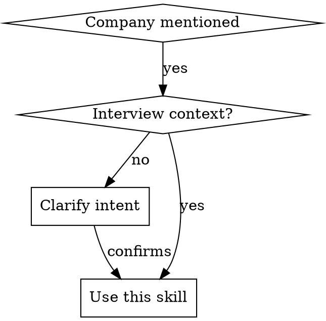

# Analyzing Companies for Interviews

## Overview

Comprehensive company research for interview preparation. Deep research across financial, employee sentiment, customer reviews, competitive landscape, analyst coverage, and recent news to build interview talking points and informed questions.

## When to Use



**Triggers:**
- Explicit command: `/analyze-company [Company Name]`
- Conversational: "research Microsoft", "analyze this company"
- Context: Discussing interviews with specific company

**Clarify if ambiguous:**
- "Apple" → Could be tech or other industries
- "Google" → Automatically translate to "Alphabet Inc."

**Default assumptions:**
- Role: Senior Sales Engineer (Atlanta) unless specified otherwise
- Depth: Moderate (5-10 pages)
- Focus: Current state (last 90-120 days unless historical crucial)

## Research Workflow

### Step 0: Confirmation & Preliminary Checks

**ALWAYS confirm before starting** - this is expensive:

```
"Ready to analyze [Company Name]. I will research:
- Financial health (10-K filings, unusual items)
- Employee sentiment (Glassdoor, Blind, Reddit)
- Customer reviews (G2, TrustRadius)
- Competitive landscape + SWOT
- Analyst coverage (Gartner, Forrester, GigaOm)
- Recent news and social media
- Interview prep sections

Proceed?"
```

**Check if analysis already exists:**
```bash
ls /home/psimmons/projects/interview-tracking/companies/[company-name].md
```
If exists: Load it, identify deltas since last update, highlight what changed

**Ask clarifying questions if needed:**
- "Which business line is most relevant to your role?"
- "Any specific concerns about this company?"

### Step 1: Parallel Agent Spawning (CRITICAL - Do NOT run sequential searches)

**Spawn 6-8 parallel subagents simultaneously:**

| Agent | Research Focus |
|-------|----------------|
| **Agent 1** | 10-K filings (SEC), legal risks, debt, customer concentration, insider trading |
| **Agent 2** | Employee sentiment: Glassdoor, Blind.com, Reddit (r/cscareerquestions, company subs), role-specific reviews, compensation data |
| **Agent 3** | Customer reviews: G2, TrustRadius, PeerSpot, testimonials, case studies, complaints |
| **Agent 4** | Competitors: Top 3-5 per business line, SWOT per competitor, head-to-head comparisons |
| **Agent 5** | Analyst coverage: Gartner (Magic Quadrant, Cool Vendor), Forrester (Wave), GigaOm |
| **Agent 6** | Recent news (last 90-120 days): LinkedIn, Twitter/X, controversies, layoffs, funding |
| **Agent 7** | Interview-specific: Common questions, "Why work here?" talking points, questions to ask |

**Wait for all agents** → Synthesize findings

### Step 2: Research Priority Order

**HIGH PRIORITY** (User emphasis):
1. Employee sentiment - Blind.com, Reddit, Glassdoor (role-specific)
2. Financial red flags - 10-K unusual items, litigation, debt

**MEDIUM PRIORITY:**
3. Customer sentiment - G2, TrustRadius, complaints
4. Competitive analysis - SWOT, positioning
5. Interview prep sections

**LOW PRIORITY:**
6. Analyst coverage - Gartner, Forrester, GigaOm
7. Generic company facts (funding, investors)

### Step 3: Information Depth Rules

**Search strategies:**
- Blind.com: Look for anonymous employee feedback (no company login)
- Reddit: Search "[Company] interview" + "[Company] employee" + role-specific
- 10-K filings: Look for "Item 1A. Risk Factors", "Item 3. Legal Proceedings"
- G2/TrustRadius: Filter by role (Solutions Engineer, Sales Engineer)
- Competitors: Search "[Company] vs [Competitor]" for head-to-head comparisons
- Salary: Compare Atlanta-specific data for Sales Engineers across competitors

**What to emphasize:**
- Recent reviews (last 90-120 days) over older data
- Negative information (all companies have it - don't hide)
- Role-specific insights over generic company info

## Output Structure

**Location:** `/home/psimmons/projects/interview-tracking/companies/[company-name].md`

**Frontmatter for Obsidian:**
```yaml
---
type: company
company: [Company Name]
created: [YYYY-MM-DD]
updated: [YYYY-MM-DD]
tags: [company, interview-prep, [industry], [role]]
---
```

**Required sections:**
```markdown
# [Company Name] - Company Analysis

## Quick Facts
- Industry, HQ, size, funding/revenue
- Key products/business lines
- Major customers
- Recognition (Gartner, Forrester, awards)

## Financial Health
- 10-K unusual items (legal risks, debt, customer concentration)
- Recent lawsuits or regulatory issues
- Insider trading or management changes
- Funding status, profitability trends

## Employee Sentiment (HIGH PRIORITY)
- Glassdoor summary (rating, pros/cons)
- Blind.com insights (anonymous feedback)
- Reddit discussions (company-specific subs, r/cscareerquestions)
- Role-specific reviews (Solutions Engineer experiences)
- Compensation data for role in location
- Office culture (Atlanta-specific if applicable)

## Customer Sentiment
- G2/TrustRadius ratings and reviews
- Customer testimonials and case studies
- Common complaints or churn patterns
- Product quality feedback

## Competitive Analysis
- Top 3-5 competitors per business line
- SWOT analysis (Strengths, Weaknesses, Opportunities, Threats)
- Head-to-head comparisons with competitors
- Market positioning

## Analyst Coverage
- Gartner: Magic Quadrant, Cool Vendor, Peer Insights
- Forrester: Wave reports
- GigaOm coverage
- Industry trend reports

## Recent News (Last 90-120 Days)
- Product launches, partnerships
- Layoffs, hiring freezes
- Funding, acquisitions
- Controversies, negative press
- Leadership changes

## Interview Preparation

### Common Interview Questions About [Company]
- Questions they frequently ask
- Topics they want to test you on

### "Why Work Here?" Talking Points
- Specific business lines to mention
- Recent achievements to reference
- Company culture fit points

### Questions to Ask the Interviewer
- Role-specific questions
- Culture questions based on research
- Strategic questions about direction

## Update History
- [YYYY-MM-DD]: Initial analysis
- [YYYY-MM-DD]: Updated - [deltas since last update]
```

### Update/Refresh Logic

**When analysis already exists:**
1. Load existing file
2. Compare new research vs old
3. Create "Update History" section with date-stamped deltas
4. Highlight what aged well vs what aged poorly
5. Note new negative information (critical for interview prep)

**Delta examples:**
- "Good news that aged well: Q4 2025 product launch successful"
- "Bad news development: January 2026 layoffs in engineering"
- "New competitive threat: Competitor X announced similar feature"

## Common Mistakes

| Excuse | Reality |
|--------|---------|
| "Basic web search is enough" | Misses 80% of critical interview prep data |
| "Glassdoor covers employee sentiment" | Blind and Reddit have more honest, unfiltered feedback |
| "Found the competitors" | Didn't analyze competitive positioning or create SWOT |
| "Salary data is generic enough" | Need Atlanta-specific + role-specific + competitor comparison |
| "Sequential searches are fine" | Could spawn 5-10 parallel agents, save 10+ minutes |
| "Manual organization is okay" | Should auto-generate proper markdown structure with metadata |
| "I'll just do quick research" | Interview prep requires DEEP research, not surface-level |
| "Don't need 10-K for interview" | Unusual 10-K items reveal risks interviewers won't mention |
| "Can't access Blind without company login" | Public posts exist - search for them |
| "Recent news is too broad" | Focus on last 90-120 days for interview relevance |

## Red Flags - STOP and Start Over

- Running sequential searches instead of parallel agents
- Checking only Glassdoor for employee sentiment
- Skipping Blind.com or Reddit research
- Not checking if analysis already exists
- Creating analysis without Obsidian frontmatter
- Missing role-specific reviews or compensation data
- Not including negative information
- Skipping SWOT analysis
- Forgetting to confirm company name before starting
- Running searches without confirmation prompt

**All of these mean: Stop, review the workflow, start over.**

## Real-World Impact

**Before this skill (Cyberhaven baseline test):**
- Superficial research (web searches only)
- Missed 80% of critical interview data
- No employee sentiment depth (Glassdoor surface only)
- No 10-K financial research
- No SWOT or competitive analysis
- No proper markdown output
- Took 30+ minutes with poor results

**After this skill:**
- 6-8 parallel agents run simultaneously
- Deep employee sentiment (Blind, Reddit, role-specific)
- 10-K unusual items and red flags
- SWOT analysis per competitor
- Interview prep talking points
- Proper Obsidian-formatted output
- Auto-update with delta tracking
- Takes 5-10 minutes for comprehensive research
