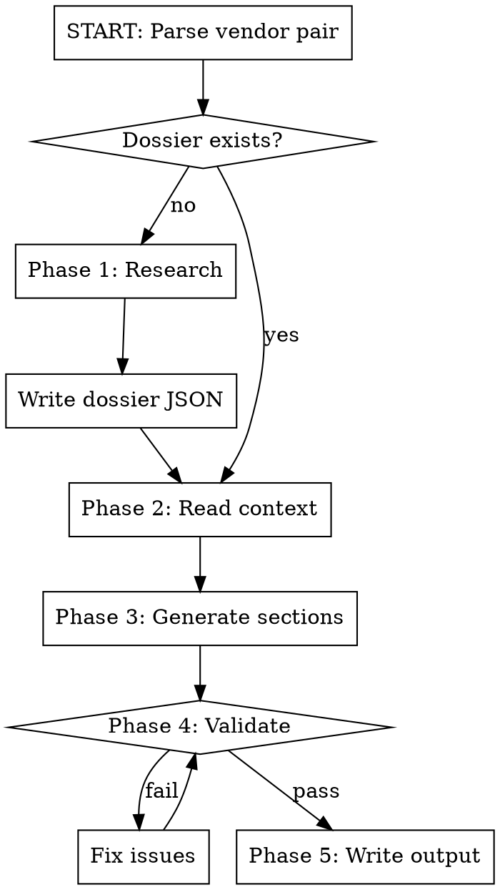

# Generate Security Intelligence Report

End-to-end Clearwatch Research report generation. Takes a vendor pair, creates research dossier if missing, generates citation-first prose, validates quality, writes output.

## Workflow

**Working directory:** `~/projects/security-intelligence-business/`

## Phase 1: Research (only when dossier missing)

Check `dossiers/` for matching JSON. If missing:

1. Read `src/templates/prompts/research_prompt.md` for full research methodology
2. Read `src/knowledge/microsoft_e5_baseline.md` for E5 data — NEVER re-research E5
3. Use **SearxNG MCP tool** for all web searches — NOT WebSearch
   - SearxNG runs on homelab K8s with dynamic pod scaling — safe to run parallel queries
   - Fire concurrent searches: pricing, MITRE results, AV-Comparatives, community sentiment, deployment timelines
4. Research areas (see research_prompt.md for complete spec):
   - Pricing: EDR tiers only, 3+ independent sources required, HIGH/MEDIUM/LOW confidence
   - Independent tests: MITRE ATT&CK (with test year), AV-Comparatives, SE Labs, CyberRatings
   - Community: G2, Reddit (r/sysadmin, r/msp, r/cybersecurity), Gartner Peer Insights
   - Deployment timelines: Practitioner sources, not vendor marketing
   - True differentiators: 3-part test (What it does / Why competitor can't match / Evidence)
   - Operational effectiveness: Automation, staffing, alert burden for ALL THREE options
5. Classify bias on every source: Funding / Selection / Incentive / Methodology / None Detected + confidence qualifier (confirmed / likely / unable to verify)
6. Write structured dossier JSON to `dossiers/{vendor1}_vs_{vendor2}.json` matching existing dossier schema

## Phase 2: Read Context

Read these files before generating any prose:

| File | Purpose |
|------|---------|
| The dossier JSON | All facts and source_ids |
| `src/templates/prompts/content_prompt.md` | Full style spec, section structure, citation format |
| `src/lib/quality_contract.py` | Section word count targets (single source of truth) |
| `src/pipeline/stage_3.py` | `SECTION_PROMPT_ENRICHMENTS` dict — section-specific rules |
| `src/knowledge/microsoft_e5_baseline.md` | E5 baseline data |

## Phase 3: Generate Sections

### Section Order and Targets

Read exact targets from `quality_contract.py`. Standard order:

| # | Section | Words | Key Requirement |
|---|---------|-------|-----------------|
| 1 | Executive Summary | 300-400 | Explain what this document IS in first 50 words, recommendations in first 200 |
| 2 | About Clearwatch Research | 150-300 | Methodology, independence, no contact info |
| 3 | Vendor Profiles | 1200-1500 | Side-by-side, market position, identity coverage if E5 involved |
| 4 | Total Cost of Ownership | 2000-2500 | 3-year projection ALL THREE, operational labor model, FTE requirements |
| 5 | Deployment & Operations | 900-1500 | Vendor-claimed AND real-world timelines, common delays |
| 6 | Detection Efficacy | 1200-2000 | MITRE for all three, alert volume, false positive rate, trends |
| 7 | Community Sentiment | 600-1000 | G2/Reddit synthesis, bias note on platforms |
| 8 | Decision Framework | 1200-2400 | TWO LAYERS: E5-vs-third-party, then vendor selection |
| 9 | Red Flags | 600-1200 | "When NOT to Choose" for each vendor, specific dealbreakers |

### Critical Rules — Non-Negotiable

**THREE-WAY FRAMING:** E5 vs Vendor1 vs Vendor2 throughout every comparison table, chart, and the decision framework. This is NOT "two vendors + a mention of E5."

**CITATION FORMAT:** `[N]` within 50 characters of every factual claim — percentages, dollar amounts, timelines, metrics. Use `source_ids` from the dossier. If you can't cite it, delete it.

**EDR TIERS ONLY:**
- CrowdStrike: Falcon Pro ($124.99) or Enterprise ($184.99) — NOT Falcon Go ($99.99, AV-only)
- SentinelOne: Singularity Complete ($179.99) — NOT Core or Control (not EDR)
- Microsoft: E5 ($684/user/year) — the ONLY path to Defender P2 EDR

**CALCULATED FIGURES:** Label as `(Clearwatch calculation: formula)` to distinguish from cited facts.
Example: "$378,000 (Clearwatch calculation: 500 users x $252 x 3 years)"

**NO RECOMMENDATIONS:** Never say "we recommend." Use "may find X the strongest fit" or "leads for organizations who..."

**E5 DISCLAIMER:** When comparing E5 to standalone EDR: "*E5 is not directly comparable to standalone EDR — includes full productivity suite*"

**VENDOR LOCK-IN:** NEVER state as fact. Use: "Some organizations report perceived switching costs..."

### Forbidden Words

Never use without an accompanying number or explicit uncertainty explanation:

| Category | Banned Words |
|----------|-------------|
| Marketing | autonomous, seamless, cutting-edge, next-gen, industry-leading, best-in-class, comprehensive, robust, innovative |
| Hedge | may, might, could, possibly, typically, usually, often, generally |
| Vague | significant, minimal, fast, slow, strong, lightweight, extensive |
| AI tells | "It's important to note", "Furthermore", "In conclusion", "It should be mentioned" |
| Weasel | particularly, effectively, very, extremely, highly |

### Style

- Senior analyst briefing a CISO — authoritative but not robotic
- Vary paragraph length: 2-6 sentences max per paragraph, mix short and medium
- Active voice predominantly, passive when appropriate for emphasis
- Every paragraph contains at least one citation
- Pull quotes: 8-12 total across report, each must add insight (not repeat adjacent prose)
- No `: Content` definition list patterns — use full sentences
- Chart markers where charts belong: `chart-cost-comparison`, `chart-timeline`, `chart-detection`, `chart-decision-matrix`

### Section-Specific Rules

Read `SECTION_PROMPT_ENRICHMENTS` from `src/pipeline/stage_3.py` for full details. Critical highlights:

- **TCO**: Show raw licensing separately from adjusted calculations. Add FTE requirements, training costs, hidden costs. Sophos doesn't publish pricing — caveat required.
- **Detection**: When noting MITRE non-participation, list ALL vendors who skipped — don't single out one.
- **Red Flags**: Any negative vendor claim must be attributed. "Users on [platform] report..." not "Vendor X causes..."
- **About Clearwatch**: Include Gartner trademark disclaimer here if Gartner referenced anywhere in report. Include Forrester trademark disclaimer if Forrester referenced.
- **Executive Summary**: End with "Bottom Line" — explicit verdict per use case.
- **Decision Framework**: Include "Total Cost of Wrong Decision" analysis and post-purchase success factors.

## Phase 4: Validate

Before writing output, verify ALL of these. Fix any failures before proceeding.

### Structure
- [ ] All 9 sections present with word counts within targets (10% tolerance)
- [ ] E5 appears in every comparison section and chart reference
- [ ] Decision framework has two layers (E5 vs third-party, then vendor selection)
- [ ] Chart markers present for cost, timeline, detection, decision matrix

### Citations & Sources
- [ ] Zero uncited facts — search for `\d+%`, `\$\d+`, timelines without `[N]` nearby
- [ ] Sources formatted as numbered markdown list: `1. Source — URL *(Bias — confidence)*`
- [ ] No internal references (`/home/`, `file://`, `localhost`)
- [ ] All calculated figures labeled `(Clearwatch calculation)`

### Language
- [ ] Zero marketing buzzwords from forbidden list
- [ ] Zero hedge words without explicit uncertainty explanation
- [ ] Zero vague adjectives without accompanying numbers
- [ ] No "we recommend" anywhere

### Legal / Credibility
- [ ] Gartner trademark disclaimer if any Gartner reference (Magic Quadrant, Peer Insights, Customers' Choice)
- [ ] Forrester trademark disclaimer if any Forrester reference (Forrester Wave, TEI, New Wave)
- [ ] "Vendor lock-in" never stated as fact
- [ ] E5 vs standalone EDR disclaimer where applicable
- [ ] Non-public pricing caveated: "*Estimates from third-party sources*"
- [ ] MITRE non-participation lists all non-participating vendors, not just one

## Phase 5: Write Output

1. **Auto-version:** Find highest version in `output/{Vendor1}_v_{Vendor2}/`, increment by 1, zero-pad to 3 digits
2. **Write files to** `output/{Vendor1}_v_{Vendor2}/{version}/`:
   - `{Vendor1}_v_{Vendor2}_{Month}_{Year}.md` — Full markdown report
   - `prose.json` — Sections with word counts
   - `endnotes.json` — Numbered sources with bias classifications
   - `summary.json` — Validation gate results
3. **Report completion** with output path and any unresolved validation warnings

## Common Mistakes

| Mistake | Fix |
|---------|-----|
| Including Falcon Go ($99.99) as EDR tier | EDR minimum: Falcon Pro ($124.99) |
| E5 mentioned only in one section | E5 in EVERY comparison table and chart |
| "We recommend CrowdStrike" | "Security-first organizations may find CrowdStrike the strongest fit" |
| Uncited TCO total like "$378,000" | "(Clearwatch calculation: 500 x $252 x 3 years)" |
| Gartner Magic Quadrant without disclaimer | Trademark notice in About section |
| 8+ sentence paragraph walls | Max 6 sentences, vary paragraph length |
| Using WebSearch for research | Use SearxNG MCP tool — free, homelab-scaled |
| Forrester Wave without disclaimer | Trademark notice in About section |
| "Vendor lock-in" stated as fact | "Perceived switching costs" with attribution |
| Single vendor singled out for skipping MITRE | List ALL non-participating vendors |
