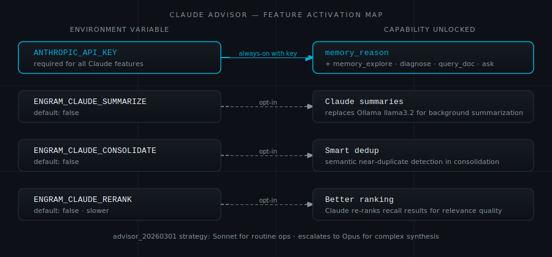
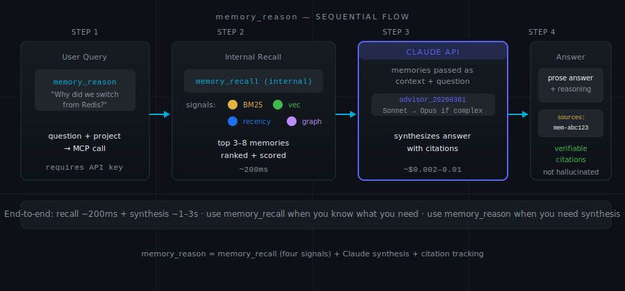

# Claude Advisor

The four Claude features are all off by default. Here is how to think about which to turn on — and which to leave alone.

<p align="center"></p>

---

## Background

Setting `ANTHROPIC_API_KEY` in your `.env` file unlocks `memory_reason` automatically. The other three features — background summarization, smart consolidation, and re-ranking — require explicit opt-in via separate environment variables.

None of them are required for Engram to work. The default configuration (Ollama for embeddings and summarization, four-signal search without re-ranking) is already good. These features are improvements for specific situations, not prerequisites.

The underlying strategy is called `advisor_20260301`. A fast Sonnet executor handles routine operations. When a decision is genuinely complex — the kind where the right answer requires reading several memories in context and synthesizing them — it escalates to Opus automatically. You pay Sonnet rates for most operations and Opus rates only for the calls that need it.

---

## memory_reason — The Flagship Feature

Every other tool fetches memories. This one thinks with them.

You ask a question in plain language. Engram recalls the relevant memories, passes them to Claude with your question, and returns a cited answer. The response names the memory IDs it drew from, so you can verify the source.

```python
memory_reason(
    question="Why did we switch from Redis to PostgreSQL for session storage? What was the trade-off?",
    project="my-app"
)
```

<p align="center"></p>

**Where it earns its keep:**

Synthesis questions. "What was the reasoning behind our auth architecture?" requires reading several related decisions and connecting them. `memory_recall` returns the raw memories; `memory_reason` returns the answer.

Consistency checks. "Are our current auth decisions consistent with the security rules we set at project start?" This requires reading two groups of memories and comparing them. `memory_recall` cannot do that in a single call.

Onboarding. "What does a new team member need to know about the payment integration?" Claude reads the relevant memories and writes a coherent summary — not a list of raw excerpts, but prose that connects the decisions and flags the gotchas.

**Where it wastes money:**

Looking up a specific fact. "What port does the database run on?" Use `memory_recall` — it is faster and costs nothing extra. `memory_reason` adds a Claude synthesis step on top of the recall. If you already know which memory you want, you do not need the synthesis.

**Cost:** Each call runs a recall plus a Claude synthesis. A typical question matches 3–8 memories and costs roughly $0.002–0.01 depending on their total length and which model tier the complexity triggers.

**Requires:** `ANTHROPIC_API_KEY` set in `.env`. No other configuration needed — this feature activates automatically once the key is present.

---

## ENGRAM_CLAUDE_SUMMARIZE — Background Summarization with Claude

**Default:** false (uses Ollama `llama3.2`)

When you store a memory, a background worker generates a short summary within 60 seconds. By default that worker uses your local Ollama model. Setting `ENGRAM_CLAUDE_SUMMARIZE=true` switches it to `claude-haiku-3`.

The difference in practice: Claude's summaries are more compressed and more precise. A local `llama3.2` summary of a complex architectural decision tends to be vaguer. For knowledge-heavy projects where you are recalling many memories at once — and therefore relying on summaries to navigate — the quality improvement is noticeable.

**When to turn it on:** You have an API key and either do not have a good local model running, or care enough about summary quality to pay a small ongoing cost.

**When to leave it off:** Routine use. The local model is free and handles most cases adequately.

**Cost:** Roughly $0.0001–0.0003 per memory summarized. A project with 200 memories costs a few cents total. This is not a significant expense — but it is not zero, and for a project you are storing memories in continuously, it adds up slowly.

---

## ENGRAM_CLAUDE_CONSOLIDATE — Smarter Near-Duplicate Detection

**Default:** false

`memory_consolidate` deduplicates near-identical memories by comparing cosine distance between their embeddings. Two memories within a similarity threshold get merged. This works well for obvious duplicates.

Setting `ENGRAM_CLAUDE_CONSOLIDATE=true` changes the decision step: instead of a pure threshold check, Claude reviews flagged pairs and decides whether to merge them. This catches cases the threshold misses — two memories that say the same thing with different vocabulary, or two memories that are technically distinct but redundant in practice.

**When to turn it on:** You are running a quarterly housekeeping pass on a large, mature memory store. Set the variable, run `memory_consolidate`, unset it.

**When to leave it off:** Routine use. The default consolidator handles most duplication well. Running Claude consolidation on every housekeeping call costs more than the quality improvement justifies for small stores.

---

## ENGRAM_CLAUDE_RERANK — Re-ranking After Recall

**Default:** false

When on, `memory_recall` accepts a `rerank=true` parameter. Engram retrieves three times as many results as requested, passes them to Claude, and asks Claude to rank them by actual relevance to the query. The top N are returned.

The four-signal ranking (BM25 + vector + recency + graph) is already good. Re-ranking adds a judgment layer on top of it — useful when the default ranking returns technically relevant but not quite right results.

```python
memory_recall("payment integration architecture", project="my-app", rerank=True)
```

**When to turn it on:** Exploratory queries where you want the best possible result and can afford a few hundred milliseconds extra. "What do we know about the payment integration?" is an exploratory query. "What is the database port?" is not.

**When to leave it off:** Session-start context loading. At the start of a session you are making several recall calls quickly, and speed matters more than marginal ranking improvement. The default four-signal ranking is good enough for context loading.

**Cost:** Roughly 3× the normal recall cost, because of the 3× over-retrieval plus the Claude ranking call.

---

## The Honest Trade-Off

Ollama is free and local. Every Claude feature costs money per call. The question is whether the quality improvement is worth it for your use case.

A plain summary of what to do:

- **memory_reason:** Turn it on if you have an API key. Synthesis questions are where Engram earns its place in a workflow, and this is the tool that answers them. The cost per question is small.
- **Claude summarize:** Turn on if you do not have a good local model running, or if summary quality visibly affects your recall results. Leave off otherwise.
- **Claude consolidate:** Turn on before a quarterly housekeeping run. Leave off for routine use.
- **Claude rerank:** Leave off by default. Turn on for exploratory queries in knowledge-heavy projects where you want the best possible result and can tolerate slightly slower recall.

The risk of turning everything on at once is not cost — it is noise. Features that run on every operation add latency and make it harder to attribute what is actually helping. Start with `memory_reason`. Add others when you have a specific reason.

---

**Previous:** [All 19 Tools](tools.md) | **Next:** [Operations](operations.md)
