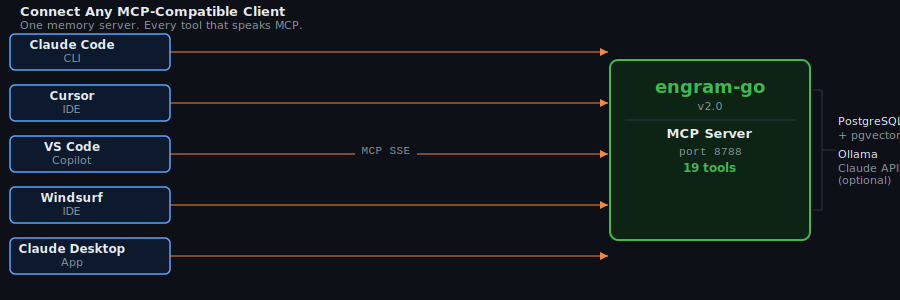

# Connecting Your IDE

Engram speaks MCP over Server-Sent Events. Any MCP-compatible client that supports SSE transport works.

The SSE endpoint is `http://localhost:8788/sse`. When Engram is running, that endpoint holds a persistent connection open and sends tool definitions and responses over it. You point your IDE at the URL, it discovers the 19 tools, and they appear in your model context.

---

<p align="center"></p>

---

## Claude Code

```bash
claude mcp add engram --transport sse http://localhost:8788/sse
```

That is the whole configuration. Claude Code stores it in your user-level MCP config and reconnects on every session.

If you set `ENGRAM_API_KEY`, pass the token as a header:

```bash
claude mcp add engram --transport sse http://localhost:8788/sse \
  --header "Authorization: Bearer your-api-key-here"
```

Verify the tools loaded:

```
/mcp
```

You should see `engram` listed with 19 tools. If the count is wrong, restart Claude Code — it reads MCP configs at startup, not on demand.

---

## Cursor

Add to `~/.cursor/mcp.json`. Create the file if it does not exist.

```json
{
  "mcpServers": {
    "engram": {
      "url": "http://localhost:8788/sse"
    }
  }
}
```

Restart Cursor. The tools appear in the model panel under MCP servers.

With authentication:

```json
{
  "mcpServers": {
    "engram": {
      "url": "http://localhost:8788/sse",
      "headers": {
        "Authorization": "Bearer your-api-key-here"
      }
    }
  }
}
```

---

## VS Code (GitHub Copilot)

VS Code reads MCP configuration from `.vscode/mcp.json` inside your workspace, or from `~/.vscode/mcp.json` for a global config that applies across all workspaces.

```json
{
  "mcpServers": {
    "engram": {
      "url": "http://localhost:8788/sse"
    }
  }
}
```

The global config is useful if you want Engram available in every project without adding the file to each repository.

---

## Windsurf

Add to `~/.codeium/windsurf/mcp_config.json`:

```json
{
  "mcpServers": {
    "engram": {
      "serverUrl": "http://localhost:8788/sse"
    }
  }
}
```

Note the key is `serverUrl`, not `url` — Windsurf uses a slightly different field name than Cursor and VS Code.

---

## Claude Desktop

Claude Desktop uses stdio transport, not SSE. It does not connect to a running server over a network port — it spawns a process and communicates over stdin/stdout. To bridge this, you tell Claude Desktop to `docker exec` into the running `engram-go-app` container and run the binary in stdio mode.

This means the Docker container must already be running when Claude Desktop starts. Run `docker compose up -d` before launching Claude Desktop.

**macOS** — edit `~/Library/Application Support/Claude/claude_desktop_config.json`:

```json
{
  "mcpServers": {
    "engram": {
      "command": "docker",
      "args": ["exec", "-i", "engram-go-app", "/engram", "server", "--transport", "stdio"],
      "disabled": false
    }
  }
}
```

**Windows** — edit `%APPDATA%\Claude\claude_desktop_config.json` with the same content.

Restart Claude Desktop after saving. The tools appear under the MCP section in the left panel.

If Claude Desktop shows an error connecting, check that the container is named `engram-go-app`:

```bash
docker ps --filter name=engram
```

The name must match exactly. If you changed the project directory name when cloning, Docker Compose may have prefixed the container differently. Update the `args` list to match.

---

## Any MCP Client

If your client supports MCP over SSE, point it at `http://localhost:8788/sse`.

If your client supports MCP over stdio only, use the same `docker exec` pattern as Claude Desktop, adapting the flags to your client's configuration format.

If your client requires a different port, set `ENGRAM_PORT` in `.env` and restart:

```bash
docker compose up -d
```

---

## Authentication

By default the SSE endpoint requires no authentication. It binds to `localhost` only, so network access is already restricted to the local machine.

To add bearer token authentication:

1. Set `ENGRAM_API_KEY=your-secret-token` in `.env`
2. Restart the server: `docker compose restart engram-go`
3. Add the `Authorization: Bearer <token>` header to your IDE config (see the Claude Code and Cursor examples above)

Every SSE connection must present the header when `ENGRAM_API_KEY` is set. Connections without it are rejected with `401 Unauthorized`.

There is no per-tool or per-project access control. Authentication is all-or-nothing at the connection level.

---

## Troubleshooting

**Tools do not appear after adding the MCP server.**
Most IDE MCP clients read configuration at startup. Restart the IDE after editing the config file.

**SSE connection drops repeatedly.**
The SSE transport is a long-lived HTTP connection. Some reverse proxies and firewalls close idle connections after 60–90 seconds. If Engram is behind a proxy, configure the proxy to allow long-lived connections (or disable the idle timeout on that path).

**"Authorization required" error.**
You have `ENGRAM_API_KEY` set but the IDE is not sending the header. Check the IDE config and confirm the header key is `Authorization` and the value starts with `Bearer `.

**Wrong number of tools (expect 19).**
The `memory_reason` tool is only registered when `ANTHROPIC_API_KEY` is set in `.env`. If that variable is empty, you will see 18 tools. Set the key and restart `engram-go`:

```bash
docker compose restart engram-go
```

---

**Previous:** [Getting Started](getting-started.md) — prerequisites, startup, and configuration reference.  
**Next:** [Tools Reference](tools.md) — all 19 tools with parameters and examples.
