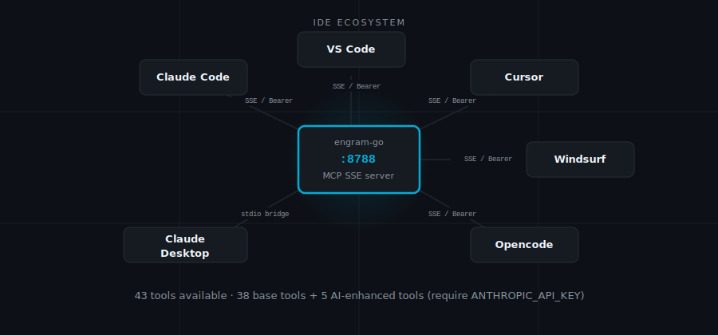

# Connecting Your IDE

Engram communicates with your IDE over Server-Sent Events — a persistent HTTP connection where the server pushes data to the client. When you point your IDE at Engram's SSE endpoint, the server sends your IDE the full list of available tools, then keeps the connection alive to carry requests and responses. From your IDE's perspective, 38 new tools just appeared. From Engram's perspective, it now has a client. The connection is live for as long as both sides are running, and your IDE does not need to poll or reconnect to get fresh results.

The SSE endpoint is `http://localhost:8788/sse`. Everything below is how you tell each IDE to find it.

---

<p align="center"></p>

---

## Claude Code

Claude Code is the easiest client to configure because Engram ships an automation for it. One command fetches your bearer token and writes it directly to the right config file — no manual copy-paste, no hunting for the right JSON path.

```bash
make setup
```

Run this once after a fresh install, and again after any container restart if the key rotates.

To configure manually:

```bash
claude mcp add engram --transport sse http://localhost:8788/sse \
  --header "Authorization: Bearer your-api-key-here"
```

Copy your `ENGRAM_API_KEY` from `.env` for the header value. Bearer authentication is required — connections without it are rejected with `401 Unauthorized`.

Verify the tools loaded:

```
/mcp
```

You should see `engram` listed with 38 tools (43 if `ANTHROPIC_API_KEY` is set — five optional AI-enhanced tools activate). If the count is wrong, restart Claude Code — it reads MCP configs at startup, not on demand.

---

## Cursor

Cursor reads MCP configuration from a JSON file in your home directory. If the file does not exist yet, create it — Cursor will pick it up on next restart.

Add to `~/.cursor/mcp.json`. Create the file if it does not exist. Bearer authentication is required — the server rejects connections without it.

```json
{
  "mcpServers": {
    "engram": {
      "url": "http://localhost:8788/sse",
      "headers": {
        "Authorization": "Bearer your-api-key-here"
      }
    }
  }
}
```

Copy your `ENGRAM_API_KEY` from `.env` for the header value. Restart Cursor after saving.

---

## VS Code (GitHub Copilot)

VS Code gives you a choice: per-workspace config (committed alongside your code) or global config (applies everywhere). The global path is useful if you want Engram available in every project without adding an extra file to each repository.

VS Code reads MCP configuration from `.vscode/mcp.json` inside your workspace, or from `~/.vscode/mcp.json` for a global config that applies across all workspaces. Bearer authentication is required.

```json
{
  "mcpServers": {
    "engram": {
      "url": "http://localhost:8788/sse",
      "headers": {
        "Authorization": "Bearer your-api-key-here"
      }
    }
  }
}
```

The global config is useful if you want Engram available in every project without adding the file to each repository.

---

## Windsurf

Windsurf uses a slightly different field name than the rest — `serverUrl` instead of `url`. Everything else follows the same pattern. If you configure Windsurf after setting up Cursor or VS Code, this is the one detail to watch.

Add to `~/.codeium/windsurf/mcp_config.json`. Bearer authentication is required.

```json
{
  "mcpServers": {
    "engram": {
      "serverUrl": "http://localhost:8788/sse",
      "headers": {
        "Authorization": "Bearer your-api-key-here"
      }
    }
  }
}
```

Note the key is `serverUrl`, not `url` — Windsurf uses a slightly different field name than Cursor and VS Code.

---

## Opencode

Opencode is strict about one thing: the URL you configure must match exactly what Engram advertises in its SSE stream. That means `127.0.0.1`, not `localhost` — they resolve to the same place, but Opencode validates the string, not the address. This is the one gotcha in an otherwise straightforward setup.

Add to `~/.config/opencode/opencode.json`. Create the file if it does not exist. Bearer authentication is required.

```json
{
  "$schema": "https://opencode.ai/config.json",
  "mcp": {
    "engram": {
      "type": "remote",
      "url": "http://127.0.0.1:8788/sse",
      "headers": {
        "Authorization": "Bearer your-api-key-here"
      }
    }
  }
}
```

Copy your `ENGRAM_API_KEY` from `.env` for the header value. **Use `127.0.0.1`, not `localhost`** — Opencode validates that the connection origin matches the `endpoint` URL advertised in the SSE stream. Since Engram advertises `http://127.0.0.1:8788` (set via `ENGRAM_BASE_URL`), your client URL must match exactly. Restart Opencode after saving.

---

## Claude Desktop

Claude Desktop works differently from every other client here. It does not speak SSE — it uses stdio transport, communicating with MCP servers over stdin/stdout by spawning a subprocess. To use Engram with Claude Desktop, you bridge the gap by telling it to `docker exec` into the running container and invoke the binary directly.

This means the Docker container must already be running when Claude Desktop starts. Run `docker compose up -d` before launching Claude Desktop.

**macOS** — edit `~/Library/Application Support/Claude/claude_desktop_config.json`:

```json
{
  "mcpServers": {
    "engram": {
      "command": "docker",
      "args": ["exec", "-i", "engram-go-app", "/engram", "server", "--transport", "stdio"],
      "disabled": false
    }
  }
}
```

**Windows** — edit `%APPDATA%\Claude\claude_desktop_config.json` with the same content.

Restart Claude Desktop after saving. The tools appear under the MCP section in the left panel.

If Claude Desktop shows an error connecting, check that the container is named `engram-go-app`:

```bash
docker ps --filter name=engram
```

The name must match exactly. If you changed the project directory name when cloning, Docker Compose may have prefixed the container differently. Update the `args` list to match.

---

## Any MCP Client

If your client supports MCP over SSE, point it at `http://localhost:8788/sse`.

If your client supports MCP over stdio only, use the same `docker exec` pattern as Claude Desktop, adapting the flags to your client's configuration format.

If your client requires a different port, set `ENGRAM_PORT` in `.env` and restart:

```bash
docker compose up -d
```

---

## Authentication

Bearer auth is not bureaucracy — it is the thing standing between your memory store and anything else running on your machine. Engram can read and write everything you have stored: decisions, patterns, credentials metadata, architectural context accumulated over months of work. A server that accepted connections from any local process without a token would be one misconfigured tool call away from exfiltrating all of it.

Bearer token authentication is required. The server refuses to start without `ENGRAM_API_KEY` set. Every SSE connection must present `Authorization: Bearer <token>` — connections without it are rejected with `401 Unauthorized`.

**For Claude Code:** `make setup` handles the token automatically.

**For other clients:** copy `ENGRAM_API_KEY` from `.env` and add the `Authorization: Bearer <token>` header to your IDE's MCP config (see the Cursor example above).

The token is stored in `.env` — never committed to git. The `/setup-token` endpoint (localhost-only) is still Bearer-protected; `make setup` bootstraps by probing local key sources such as `.env` and `~/.config/engram/api_key`, then uses that token to fetch the live config programmatically.

There is no per-tool or per-project access control. Authentication is all-or-nothing at the connection level.

---

## Troubleshooting

**Tools do not appear after adding the MCP server.**
You edited the config, but your IDE is still running with the old one. Most IDE MCP clients read configuration at startup. Restart the IDE after editing the config file.

**SSE connection drops repeatedly.**
The SSE transport holds an HTTP connection open indefinitely, and some reverse proxies and firewalls close connections they consider idle after 60–90 seconds. If Engram is behind a proxy, configure the proxy to allow long-lived connections (or disable the idle timeout on that path). The problem is not Engram — it is something between your IDE and the server closing the connection early.

**"Authorization required" error.**
You have `ENGRAM_API_KEY` set in `.env`, but the IDE is not sending it in the header. Check the IDE config and confirm the header key is exactly `Authorization` and the value starts with `Bearer ` (with a space).

**Wrong number of tools (expect 38 or 43).**
Five AI-enhanced tools (`memory_ask`, `memory_reason`, `memory_explore`, `memory_query_document`, `memory_diagnose`) only register when `ANTHROPIC_API_KEY` is set in `.env`. Without it, you see 38 tools. With it, you see 43. Set the key and restart `engram-go`:

```bash
docker compose restart engram-go
```

**403 "session bearer mismatch" after rotating `ENGRAM_API_KEY`.**
SSE sessions are bound to the bearer token presented at connection time. After a key rotation, existing sessions are invalidated — the 403 is intentional and expected. Reconnect your IDE: restart Claude Code, or reload the MCP connection in Cursor/VS Code. The old session is gone; the new one will use the new key.

**Rate limit from `/setup-token` (`make setup` returns 429).**
`/setup-token` is rate-limited to 3 requests per 5 minutes per IP. If `make setup` returns a 429, wait 5 minutes and try again. This limit protects against token enumeration — it is not meant to interfere with normal setup.

---

**Previous:** [Getting Started](getting-started.md) — prerequisites, startup, and configuration reference.  
**Next:** [Tools Reference](tools.md) — all 38 tools (43 with ANTHROPIC_API_KEY) with parameters and examples.
