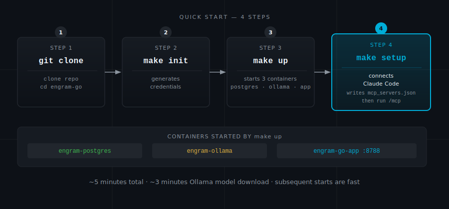

# Getting Started

When you finish this page, you will have a running memory server, a working IDE connection, and 38 tools available to every AI assistant you use. Three commands get you there. The whole thing takes about five minutes — slightly longer on first run while your configured embedding model downloads.

---

<p align="center"></p>

---

## Prerequisites

Engram runs as three Docker containers. Before you start, confirm you have what those containers need:

- **Docker Engine 20.10 or newer** — check with `docker --version`
- **Docker Compose 2.0 or newer** — check with `docker compose version` (note: the subcommand, not `docker-compose`)
- **Go 1.25 or newer** — check with `go version`; download from [https://go.dev/dl/](https://go.dev/dl/) (matches `go.mod`)
- **4 GB RAM free** — Ollama loads the embedding model into memory and keeps it there
- **2 GB disk** — PostgreSQL data volume plus the Ollama model download

Optional: an NVIDIA or AMD GPU. If you have one, embedding inference runs roughly 3× faster. Worth configuring if you plan to store large numbers of memories. Instructions are in the GPU section below.

---

## Step 1: Clone and Generate Credentials

```bash
git clone https://github.com/petersimmons1972/engram-go.git
cd engram-go
make init
```

`make init` generates two strong random credentials in `.env`:

- `POSTGRES_PASSWORD` — PostgreSQL authentication
- `ENGRAM_API_KEY` — bearer token that every MCP client must present

Both are required. The server refuses to start if either is missing. `make init` is idempotent — re-running it skips values that are already set.

Generating credentials first rather than shipping defaults means your memory store is protected from the first second it runs. Shared default passwords have ended careers. Yours will not.

---

## Step 2: Create Docker Volumes

Engram uses two external Docker volumes. External volumes survive `docker compose down` — your memories and model weights are never destroyed when containers are recreated.

```bash
docker volume create engram_pgdata
```

The Ollama model volume (`ollama_ollama_storage`) is expected to already exist from a standalone Ollama installation. If you do not have Ollama installed separately, create it now:

```bash
docker volume create ollama_ollama_storage
```

Why external? Docker's default behaviour is to create and destroy volumes alongside the compose project. An accidental `docker compose down` would delete every memory you have stored. External volumes decouple data lifetime from container lifetime — the only way to lose data is to explicitly run `docker volume rm`.

---

## Step 3: Build the Postgres Image

Engram ships a custom Postgres image with `pgvector` pre-installed. Build it once before first start:

```bash
make build-postgres
```

You only need to run this on a fresh clone. `make up` will do it automatically if the image is missing, but running it explicitly first avoids any confusion about why the first `make up` takes longer than expected.

---

## Step 4: Start

```bash
make up
```

This starts three containers:

- `engram-postgres` — PostgreSQL 16 with the pgvector extension installed
- `engram-ollama` — Ollama serving the configured embedding model
- `engram-go-app` — The MCP server, listening on port 8788

**First start takes 2–3 minutes.** Ollama downloads the configured embedding model before it reports healthy. The `engram-go-app` container will wait for it. Watch progress with:

```bash
docker compose logs ollama -f
```

Subsequent starts are fast — the model is cached in the Ollama volume.

---

## Step 5: Connect Your IDE

For Claude Code, run `make setup` once the containers are healthy:

```bash
make setup
```

This calls the `/setup-token` endpoint on the running server, retrieves the bearer token, and writes it to `~/.claude/mcp_servers.json`. Run `/mcp` in Claude Code afterward to activate the connection.

Re-run `make setup` any time the server restarts (if `ENGRAM_API_KEY` rotates) or after a fresh install.

For Cursor, VS Code, Windsurf, or Claude Desktop, see [Connecting Your IDE](connecting.md) — you will need to copy the token from `.env` manually for those clients.

---

## Verify It Is Working

This is the moment it clicks. Run these checks and watch the pieces confirm each other.

Check that all three containers are running and healthy:

```bash
docker compose ps
```

All three should show `Up (healthy)`. If any shows `Up (health: starting)`, wait 30 seconds and check again — the health checks run on a short interval.

Confirm the MCP endpoint is reachable:

```bash
curl -s http://localhost:8788/sse
# Press Ctrl+C after a second or two
```

An SSE connection returns `data:` events on a keep-alive stream. If you get `Connection refused`, one of the containers is not up yet.

In Claude Code, confirm the tools loaded:

```
/mcp
```

You should see `engram` listed with 38 tools (43 if `ANTHROPIC_API_KEY` is set — five optional AI-enhanced tools activate). If it shows fewer, restart Claude Code — IDE MCP clients cache the tool list at startup.

When you see 38 tools, you are done. The server is running, the embedding model is loaded, and your IDE has a persistent connection to your memory store.

---

## Step 6: Optional — Install Bundled Skills

Engram includes four Claude Code skills for maintenance, consolidation, and diagnostics operations. These skills wrap advanced tools and provide a user-friendly interface to operations that are powerful but rarely needed during regular sessions.

To install the bundled skills:

```bash
make install-skills
```

This copies four skill directories to `~/.claude/skills/`:
- `/engram-consolidate` — memory consolidation and decay audits
- `/engram-episodes` — session and episode management
- `/engram-ingest` — import and export operations
- `/engram-diagnose` — health checks and analytics

After install, the skills appear in your Claude Code command palette (type `/` to see them). See [MCP Tool Profiles](tools.md#mcp-tool-profiles) for details on what each skill does and why you might need it.

For most work, you do not need these skills — the core 38 tools are sufficient. Install them if you plan to manage consolidation, ingest large document sets, or run maintenance operations.

---

## Configuration Reference

Most people never touch these. `make init` handles the two required values, and the defaults for everything else are sensible. But here is the full picture for when you need it:

```bash
# ============================================================
# Database — generated by 'make init'
# ============================================================
POSTGRES_PASSWORD=                         # Required: generated by make init

# ============================================================
# Authentication — generated by 'make init'
# ============================================================
ENGRAM_API_KEY=                            # Required: bearer token for all MCP connections
                                           # Generated by make init; clients configured by make setup

# ============================================================
# Embeddings
# ============================================================
OLLAMA_URL=http://ollama:11434             # Default: Ollama inside Docker
# OLLAMA_URL=http://host.docker.internal:11434  # Mac: native Ollama outside Docker

ENGRAM_OLLAMA_MODEL=mxbai-embed-large     # Any 1024-dim compatible Ollama embedding model works here

# ============================================================
# Background summarization
# ============================================================
ENGRAM_SUMMARIZE_MODEL=llama3.2           # Ollama model for async summary generation

# ============================================================
# Server
# ============================================================
ENGRAM_PORT=8788                           # Change if 8788 conflicts with something else
ENGRAM_TRUST_PROXY_HEADERS=false           # Set to 1 when behind a trusted reverse proxy

# ============================================================
# Claude Advisor (all off by default — requires Anthropic API key)
# ============================================================
ANTHROPIC_API_KEY=                         # Set this to enable memory_reason and Claude features
ENGRAM_CLAUDE_SUMMARIZE=false             # Use Claude instead of Ollama for summaries
ENGRAM_CLAUDE_CONSOLIDATE=false           # Use Claude for consolidation analysis
ENGRAM_CLAUDE_RERANK=false                # Use Claude to rerank results (slower, better)
```

| Variable                   | Default              | Required | Purpose                                               |
| -------------------------- | -------------------- | -------- | ----------------------------------------------------- |
| `POSTGRES_PASSWORD`        | *(none)*             | **Yes**  | PostgreSQL password — generated by `make init`        |
| `ENGRAM_API_KEY`           | *(none)*             | **Yes**  | Bearer token for all SSE connections — generated by `make init` |
| `OLLAMA_URL`               | `http://ollama:11434`| No       | URL of the Ollama embedding service                   |
| `ENGRAM_OLLAMA_MODEL`      | *(none)*             | Yes      | Embedding model name (must be configured)            |
| `ENGRAM_SUMMARIZE_MODEL`   | `llama3.2`           | No       | Ollama model for background summaries                 |
| `ENGRAM_PORT`              | `8788`               | No       | Port the MCP server binds to                          |
| `ANTHROPIC_API_KEY`        | *(empty)*            | No       | Enables `memory_reason` tool and Claude-backed features |
| `ENGRAM_CLAUDE_SUMMARIZE`  | `false`              | No       | Use Claude for async summaries instead of Ollama      |
| `ENGRAM_CLAUDE_CONSOLIDATE`| `false`              | No       | Use Claude for graph consolidation                    |
| `ENGRAM_CLAUDE_RERANK`     | `false`              | No       | Use Claude to rerank search results                   |
| `POSTGRES_DB`              | `engram`             | No       | Database name (rarely needs changing)                 |
| `POSTGRES_USER`            | `engram`             | No       | Database user (rarely needs changing)                 |
| `ENGRAM_TRUST_PROXY_HEADERS` | `false`              | No       | Trust `X-Forwarded-For` / `X-Real-IP` for rate limiting. Set to `1` only when a trusted reverse proxy is in front. |
| `ENGRAM_RECALL_MAX_TOP_K`  | `500`                | No       | Hard cap on results returned by `memory_recall`. Increase for bulk export use cases. |
| `ENGRAM_REEMBED_BATCH_SIZE`| `100`                | No       | Chunks processed per GlobalReembedder iteration. Increase for faster catch-up after model changes. |
| `ENGRAM_REEMBED_INTERVAL`  | `10s`                | No       | Delay between GlobalReembedder polling iterations. Accepts Go duration strings (`10s`, `1m`). |

---

## Secret Management: Infisical or Direct Environment Variable

The `engram-go` container uses a small `starter` binary as its entrypoint. Its job is to inject secrets before the server process starts. It supports two modes:

### Option A: Direct environment variable (simplest)

Set `ENGRAM_API_KEY` directly in `.env` (which `make init` does for you). The starter detects that `INFISICAL_CLIENT_ID` is absent and skips the Infisical fetch entirely, using the key already in the environment:

```bash
# .env — generated by make init
ENGRAM_API_KEY=your-key-here
POSTGRES_PASSWORD=your-password-here
```

This is the default path. No additional configuration needed.

### Option B: Infisical machine identity

If you manage secrets via Infisical, add a `.env.machine-identity` file (created empty by `make init`) with your machine identity credentials:

```bash
# .env.machine-identity — never commit this file
INFISICAL_CLIENT_ID=your-client-id
INFISICAL_CLIENT_SECRET=your-client-secret
# Optional overrides (defaults shown):
# INFISICAL_DOMAIN=https://infisical.yourcompany.com
# INFISICAL_PROJECT_ID=your-project-id
# INFISICAL_ENV=prod
# INFISICAL_SECRET_PATH=/apps/engram
```

When `INFISICAL_CLIENT_ID` is set, the starter authenticates to Infisical and fetches `ENGRAM_API_KEY` and `POSTGRES_PASSWORD` at container startup. The credentials are injected into the environment and the machine identity credentials are scrubbed before `engram` starts.

If neither `INFISICAL_CLIENT_ID` nor `ENGRAM_API_KEY` is set, the starter exits with a clear error explaining both options.

---

## GPU Acceleration

If you store a lot of memories, this matters. Every `memory_store` call runs an embedding pass through Ollama. On CPU, that is fast enough for normal use. Under heavy ingest — bulk imports, frequent stores across many projects — GPU acceleration makes the difference between a snappy tool and one that makes you wait.

### NVIDIA

Edit `docker-compose.yml` and uncomment the `deploy` block under the `ollama` service. It looks like this:

```yaml
    # deploy:
    #   resources:
    #     reservations:
    #       devices:
    #         - driver: nvidia
    #           count: 1
    #           capabilities: [gpu]
```

Remove the `#` characters. Then ensure you have the [NVIDIA Container Toolkit](https://docs.nvidia.com/datacenter/cloud-native/container-toolkit/install-guide.html) installed on the host.

### AMD (ROCm)

Change the Ollama image to `ollama/ollama:rocm` and uncomment the `devices` block in `docker-compose.yml`. Your user must be in the `render` and `video` groups:

```bash
sudo usermod -aG render,video $USER
```

Log out and back in for the group change to take effect.

### Mac (M-series)

Docker Desktop on Mac does not pass Metal GPU through to Linux containers. The practical solution is to run Ollama natively:

```bash
brew install ollama
ollama serve
```

Then in `.env`, change the Ollama URL:

```bash
OLLAMA_URL=http://host.docker.internal:11434
```

And comment out the `ollama` service in `docker-compose.yml` so Docker does not start the container Ollama. The `engram-go-app` container will use your native Ollama instead.

---

## Common Problems

**Port 8788 is already in use.**
Something else claimed that port before Engram did. Set `ENGRAM_PORT=8789` (or any free port) in `.env`, restart with `docker compose up -d`, and update the port in your IDE config.

**Embedding model not found / connection errors on first start.**
Ollama is still downloading the model — it can look like a crash when it is really just slow. Watch it finish:

```bash
docker compose logs ollama -f
```

Wait for a line like `llm server listening`. Then the `engram-go-app` container will become healthy.

**IDE says connection refused.**
Either a container is not up yet, or `engram-go-app` is waiting on its dependencies. Confirm the state:

```bash
docker compose ps
```

If `engram-go-app` shows `Up (health: starting)`, it is waiting for Postgres or Ollama. Give it 30 seconds. If it shows `Exit`, the process crashed — check the logs to see why:

```bash
docker compose logs engram-go-app
```

The most common causes are a missing `POSTGRES_PASSWORD` or `ENGRAM_API_KEY`. Run `make init` to generate both.

**`POSTGRES_PASSWORD must be set` error before containers start.**
Docker Compose requires `POSTGRES_PASSWORD` — there is no default, and this error fires before any container starts (not inside the logs). Run `make init` to generate it, or set it manually in `.env`.

**Ollama SSRF protection rejects your `OLLAMA_URL`.**
If you see `ollama URL resolved to private IP` in the logs, your `OLLAMA_URL` hostname is resolving to a private address that does not match the configured host. The configured host is always allowed. This error means the hostname in `OLLAMA_URL` resolves differently at dial time than expected — check for DNS misconfiguration or a mismatched `OLLAMA_URL` value.

---

**Previous:** [How It Works](how-it-works.md) — the full technical story.  
**Next:** [Connecting Your IDE](connecting.md) — exact config for Cursor, VS Code, Windsurf, and Claude Desktop.
