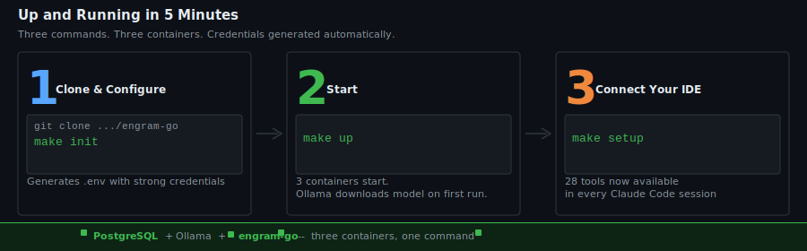

# Getting Started

Five minutes and three commands. Here is the fastest path from zero to working.

---

<p align="center"></p>

---

## Prerequisites

Before you start, confirm you have:

- **Docker Engine 20.10 or newer** — check with `docker --version`
- **Docker Compose 2.0 or newer** — check with `docker compose version` (note: the subcommand, not `docker-compose`)
- **4 GB RAM free** — Ollama loads the embedding model into memory and keeps it there
- **2 GB disk** — PostgreSQL data volume plus the Ollama model download (~270 MB)

Optional: an NVIDIA or AMD GPU. If you have one, embedding inference runs roughly 3× faster. Worth configuring if you plan to store large numbers of memories. Instructions are in the GPU section below.

---

## Step 1: Clone and Configure

```bash
git clone https://github.com/petersimmons1972/engram-go.git
cd engram-go
cp .env.example .env
```

Open `.env`. There is one required change:

```bash
POSTGRES_PASSWORD=change-me-to-something-strong
```

Set it to anything strong. Everything else in the file works out of the box for a local development setup. The full reference for all twelve variables is at the bottom of this page.

---

## Step 2: Start

```bash
docker compose up -d
```

This starts three containers:

- `engram-postgres` — PostgreSQL 16 with the pgvector extension installed
- `engram-ollama` — Ollama serving the `nomic-embed-text` embedding model
- `engram-go-app` — The MCP server, listening on port 8788

**First start takes 2–3 minutes.** Ollama downloads the `nomic-embed-text` model (~270 MB) before it reports healthy. The `engram-go-app` container will wait for it. Watch progress with:

```bash
docker compose logs ollama -f
```

Subsequent starts are fast — the model is cached in the Ollama volume.

---

## Step 3: Connect Your IDE

For Claude Code:

```bash
claude mcp add engram --transport sse http://localhost:8788/sse
```

For Cursor, VS Code, Windsurf, or Claude Desktop, see [Connecting Your IDE](connecting.md).

---

## Verify It Is Working

Check that all three containers are running and healthy:

```bash
docker compose ps
```

All three should show `Up (healthy)`. If any shows `Up (health: starting)`, wait 30 seconds and check again — the health checks run on a short interval.

Confirm the MCP endpoint is reachable:

```bash
curl -s http://localhost:8788/sse
# Press Ctrl+C after a second or two
```

An SSE connection returns `data:` events on a keep-alive stream. If you get `Connection refused`, one of the containers is not up yet.

In Claude Code, confirm the tools loaded:

```
/mcp
```

You should see `engram` listed with 19 tools. If it shows fewer, restart Claude Code — IDE MCP clients cache the tool list at startup.

---

## Configuration Reference

All configuration lives in `.env`. Here is the full set of variables.

```bash
# ============================================================
# Database
# The only setting you must change before running in production
# ============================================================
POSTGRES_PASSWORD=change-me-in-production

# ============================================================
# Embeddings
# ============================================================
OLLAMA_URL=http://ollama:11434             # Default: Ollama inside Docker
# OLLAMA_URL=http://host.docker.internal:11434  # Mac: native Ollama outside Docker

ENGRAM_OLLAMA_MODEL=nomic-embed-text      # Any Ollama embedding model works here

# ============================================================
# Background summarization
# ============================================================
ENGRAM_SUMMARIZE_MODEL=llama3.2           # Ollama model for async summary generation

# ============================================================
# Server
# ============================================================
ENGRAM_PORT=8788                           # Change if 8788 conflicts with something else
ENGRAM_API_KEY=                            # Optional: require Bearer token auth on SSE

# ============================================================
# Claude Advisor (all off by default — requires Anthropic API key)
# ============================================================
ANTHROPIC_API_KEY=                         # Set this to enable memory_reason tool
ENGRAM_CLAUDE_SUMMARIZE=false             # Use Claude instead of Ollama for summaries
ENGRAM_CLAUDE_CONSOLIDATE=false           # Use Claude for consolidation analysis
ENGRAM_CLAUDE_RERANK=false                # Use Claude to rerank results (slower, better)
```

| Variable                   | Default              | Purpose                                               |
| -------------------------- | -------------------- | ----------------------------------------------------- |
| `POSTGRES_PASSWORD`        | *(none)*             | PostgreSQL password — must be set                     |
| `OLLAMA_URL`               | `http://ollama:11434`| URL of the Ollama embedding service                   |
| `ENGRAM_OLLAMA_MODEL`      | `nomic-embed-text`   | Embedding model name                                  |
| `ENGRAM_SUMMARIZE_MODEL`   | `llama3.2`           | Ollama model for background summaries                 |
| `ENGRAM_PORT`              | `8788`               | Port the MCP server binds to                          |
| `ENGRAM_API_KEY`           | *(empty)*            | If set, requires `Authorization: Bearer <key>` on SSE |
| `ANTHROPIC_API_KEY`        | *(empty)*            | Enables `memory_reason` and Claude-backed features    |
| `ENGRAM_CLAUDE_SUMMARIZE`  | `false`              | Use Claude for async summaries instead of Ollama      |
| `ENGRAM_CLAUDE_CONSOLIDATE`| `false`              | Use Claude for graph consolidation                    |
| `ENGRAM_CLAUDE_RERANK`     | `false`              | Use Claude to rerank search results                   |
| `POSTGRES_DB`              | `engram`             | Database name (rarely needs changing)                 |
| `POSTGRES_USER`            | `engram`             | Database user (rarely needs changing)                 |

---

## GPU Acceleration

### NVIDIA

Edit `docker-compose.yml` and uncomment the `deploy` block under the `ollama` service. It looks like this:

```yaml
    # deploy:
    #   resources:
    #     reservations:
    #       devices:
    #         - driver: nvidia
    #           count: 1
    #           capabilities: [gpu]
```

Remove the `#` characters. Then ensure you have the [NVIDIA Container Toolkit](https://docs.nvidia.com/datacenter/cloud-native/container-toolkit/install-guide.html) installed on the host.

### AMD (ROCm)

Change the Ollama image to `ollama/ollama:rocm` and uncomment the `devices` block in `docker-compose.yml`. Your user must be in the `render` and `video` groups:

```bash
sudo usermod -aG render,video $USER
```

Log out and back in for the group change to take effect.

### Mac (M-series)

Docker Desktop on Mac does not pass Metal GPU through to Linux containers. The practical solution is to run Ollama natively:

```bash
brew install ollama
ollama serve
```

Then in `.env`, change the Ollama URL:

```bash
OLLAMA_URL=http://host.docker.internal:11434
```

And comment out the `ollama` service in `docker-compose.yml` so Docker does not start the container Ollama. The `engram-go-app` container will use your native Ollama instead.

---

## Common Problems

**Port 8788 is already in use.**
Set `ENGRAM_PORT=8789` (or any free port) in `.env`, restart with `docker compose up -d`, and update the port in your IDE config.

**Embedding model not found / connection errors on first start.**
Ollama is still downloading the model. Watch it finish:

```bash
docker compose logs ollama -f
```

Wait for a line like `llm server listening`. Then the `engram-go-app` container will become healthy.

**IDE says connection refused.**
Confirm all three containers are up and healthy:

```bash
docker compose ps
```

If `engram-go-app` shows `Up (health: starting)`, it is waiting for Postgres or Ollama. Give it 30 seconds. If it shows `Exit`, check the logs:

```bash
docker compose logs engram-go-app
```

The most common cause is a missing or wrong `POSTGRES_PASSWORD`.

---

**Previous:** [How It Works](how-it-works.md) — the full technical story.  
**Next:** [Connecting Your IDE](connecting.md) — exact config for Cursor, VS Code, Windsurf, and Claude Desktop.
