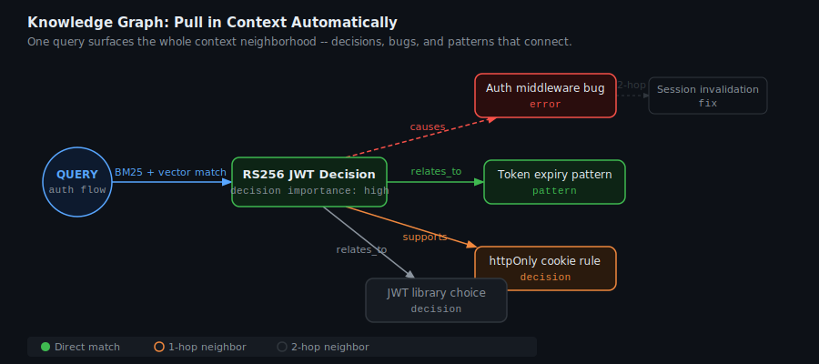

# How Engram Works

When you call `memory_recall`, here is what happens in the next 200 milliseconds.

Your query string hits four independent search paths simultaneously. Their scores are combined into a single ranked list. Graph neighbors of the top results are pulled in. The final list is returned — already filtered to the detail level you asked for.

That is the whole system. The rest of this page explains each step in enough depth that you can predict how Engram will behave in the edge cases that matter.

---

<p align="center"></p>

---

## The Four Search Signals

### BM25 Keyword Search

PostgreSQL runs BM25 over a `tsvector` index built with Porter stemming. Think of it as a library catalog that has been taught that "authenticate" and "auth" and "authentication" are the same entry, and that "timeout" and "timed out" are close enough to list together.

Store a memory containing "authentication timeout under load" and later search "auth expiry" — the stemmer closes the gap. BM25 is fast (it is a standard index scan) and reliable for exact technical concepts: function names, error codes, flag names, file paths.

It does not understand meaning. "Database lock contention" and "WAL write blocked" look unrelated to BM25 even if they describe the same problem. That is what vector search is for.

### Vector Semantic Search

Every memory is chunked at sentence boundaries — not word limits, because splitting mid-sentence destroys the meaning of both halves. Each chunk is embedded into a 768-dimensional vector using the `nomic-embed-text` model served by Ollama.

At recall time your query is embedded by the same model and cosine distance finds the closest chunks. Two memories can share zero words and still be close neighbors in this space. Store "WAL mode timeout under concurrent writes," search "database lock contention" — different vocabulary, similar meaning, they surface together.

The embedding model runs locally. There is no external API call on the recall path. If Ollama is unreachable (restart, OOM, first-boot model download still in progress), Engram degrades gracefully: BM25 gets 0.85 weight and recency gets 0.15, and you get results.

### Recency Decay

Memories decay exponentially via `exp(-0.01 × hours)`. A memory stored today scores roughly 1300× higher on the recency signal than one stored a month ago — but a month-old memory still surfaces if nothing more recent is relevant.

Nothing is deleted. Old memories do not disappear — they step back. The decay is a weight, not a filter. If you have only one memory that matches a query, it surfaces regardless of age.

When you call `memory_correct`, both versions of the memory persist. The new version wins on recency and Engram creates a `supersedes` relationship between them in the knowledge graph. The old version stays queryable for audit purposes.

### Knowledge Graph Enrichment

After the three signals produce a scored list, the top results act as seeds for a graph traversal. Engram follows edges up to two hops and adds the neighbors to the result set — boosted slightly less than the seed memories, but present.

Store a bug report. Store the architectural pattern that caused it. Connect them with a `causes` edge. Now a query about the pattern automatically surfaces the bug, because the traversal follows the edge from pattern to bug. You do not need to remember to ask about both.

---

## The Scoring Formula

```
composite = (vector × 0.45) + (bm25 × 0.30) + (recency × 0.10) + (precision × 0.15)
final     = composite × importance_multiplier
```

Without embeddings available:

```
composite = (bm25 × 0.85) + (recency × 0.15)
```

The importance multiplier is set at store time and applied at recall time. It is a flat scaling factor — a `critical` memory with a mediocre composite score still beats a `trivial` memory with a strong one.

Two additional signals feed into the composite:

**Retrieval precision** (`times_useful / times_retrieved`) gets its own weight (0.15). New memories with fewer than 5 retrievals are scored at 0.5 — neutral, neither helped nor hurt.

**Dynamic importance** replaces the static importance multiplier for memories that have been retrieved and marked useful via `memory_feedback`. The system tracks a spaced-repetition schedule (`next_review_at`) and applies an extra boost to memories that are due for review. Once a memory accumulates retrieval history, `dynamic_importance` supersedes the initial static weight.

Both signals appear in the `score_breakdown` map returned with each result, so you can inspect exactly how a score was composed.

---

## Context-Efficient Recall

The `detail` parameter controls how much text comes back per memory.

| `detail=`         | What you get                          | Typical size     | When to use                            |
| ----------------- | ------------------------------------- | ---------------- | -------------------------------------- |
| `"summary"` (default) | 1–2 sentence generated summary   | ~150 chars       | AI agents — preserve context window    |
| `"chunk"`         | The matched excerpt                   | ~200 chars       | When the specific passage that matched matters |
| `"full"`          | Original content                      | 200–50,000 chars | Export, debugging, full fidelity       |

Summaries are generated asynchronously by a background goroutine. When you store a new memory, the summary is not immediately available — the goroutine picks it up within 30 seconds. Until then, `detail="summary"` falls back to the matched chunk, which is a reasonable approximation.

At scale, summary mode reduces context consumption by roughly 13× compared to full mode. For an agent that recalls 10 memories per session, that is the difference between using 5% of a context window and using 65%.

<p align="center"></p>

### Importance Multipliers

Five levels, applied as multipliers on the final composite score. The formula is `(5 - importance_level) / 3.0`:

- **Critical (1.67×):** Non-negotiable constraints. "Never use raw SQL outside the Repository layer." These always surface near the top.
- **High (1.33×):** Key decisions that should stay visible for weeks or months. Architecture choices, major trade-offs.
- **Medium (1.0×):** The baseline. Most memories belong here.
- **Low (0.67×):** Notes you want to keep but do not need to see unless you specifically search for them.
- **Trivial (0.33×):** Ephemeral observations. Auto-pruned after 30 days if never accessed.

Set `critical` sparingly. If everything is critical, nothing is.

---

## Knowledge Graph

Engram tracks six relationship types between memories:

| Relationship    | Meaning                                        | Example                                         |
| --------------- | ---------------------------------------------- | ----------------------------------------------- |
| `causes`        | This memory led to or produces that one        | Architecture decision → downstream bug          |
| `caused_by`     | This memory exists because of that one         | Bug → the pattern that introduced it            |
| `relates_to`    | Adjacent context, no causal direction          | Two components that interact                    |
| `supersedes`    | This memory replaces that one                  | Corrected decision → original (now stale) one   |
| `supports`      | Evidence or reinforcement                      | Test pattern → the principle it validates       |
| `contradicts`   | Conflict or tension                            | New finding → prior assumption                  |

Edges have weights between 0.0 and 1.0, starting at 1.0 and decaying over time with `memory_consolidate`. When `memory_feedback` marks a recalled memory as useful, the edges that surfaced it are strengthened. Edges that fall below 0.1 are pruned.

Two-hop traversal means: a query returns a memory, that memory's neighbors are added, and so are the neighbors of those neighbors. Three degrees of separation from your query. This is enough to surface the bug caused by a pattern you queried, and the test that validates the fix for the bug — in a single call.

The graph does not require manual maintenance to stay useful. It self-optimizes toward what your queries actually find relevant, over time.

<p align="center"></p>

---

## Episodic Memory

Every SSE connection automatically starts an episode in the `global` project. When Claude Code connects to Engram, a new episode is created with a description like `"Claude Code session 2026-04-11T14:30:00Z"`. This requires no manual call to `memory_episode_start`.

Episodes group memories from a session together, making it easy to review everything that happened in a specific working session:

```python
# List recent sessions
memory_episode_list(project="global")

# Recall all memories from a specific session
memory_episode_recall(episode_id="ep-id-here", project="global")
```

Manual episode management is still available. `memory_episode_start` creates an explicitly named episode — useful for marking the start of a specific task. `memory_episode_end` closes it with an optional summary. Memories stored while an episode is open are tagged with its ID.

---

## Background Workers

Two goroutines start with the server and run on a fixed tick.

**Summarizer (60-second tick):** Finds memories with no generated summary, calls the configured model (Ollama `llama3.2` by default, or Claude if `ENGRAM_CLAUDE_SUMMARIZE=true`), stores the result back. The goroutine logs failures but does not crash — a memory without a summary is not a broken memory.

**Re-embedder (30-second tick):** Finds chunks with NULL embedding vectors — new memories not yet embedded, or chunks from a pre-embedding migration. Calls Ollama's embedding endpoint and fills them in. Vector search is accurate only for chunks with embeddings, so this goroutine keeps the index current. On first start it may take a few minutes to process a large existing store.

Neither goroutine needs configuration. They are always running.

---

## Memory Types

Six types let agents and queries filter by context.

| Type           | Use it for                                  | Example                                                        |
| -------------- | ------------------------------------------- | -------------------------------------------------------------- |
| `decision`     | Choices made and their reasoning            | "Chose PostgreSQL — needed JSONB and array columns"            |
| `pattern`      | Recurring code or architecture patterns     | "All DB access goes through Repository, never raw SQL"         |
| `error`        | Bugs, gotchas, known failures               | "Port 3000 taken on this server — always use 3001"             |
| `context`      | General project or environment facts        | "Running Ubuntu 22.04, K8s on 3 nodes"                        |
| `architecture` | System design, data flow, component layout  | "Auth: client → /api/login → JWT (RS256) → httpOnly cookie"   |
| `preference`   | Style and convention preferences            | "Always tabs, 120-char lines, no trailing commas"              |

Filtering by type is a hard filter, not a weight. `memory_recall("database", memory_types=["error"])` returns only errors — nothing of any other type, regardless of relevance score.

Use types consistently. The value compounds: once you have stored 50 `error` memories, querying them by type before starting a debugging session gives you a cheap checklist of everything that has gone wrong before.

---

## What Engram Does Not Do

It does not delete memories on correction — it supersedes them. It does not forget on shutdown — everything is in PostgreSQL. It does not require a working Ollama to return results — BM25 and recency keep working. It does not enforce uniqueness — you can store the same fact twice; the graph and recency will naturally surface whichever version is newer.

---

**Next:** [Getting Started](getting-started.md) — running in five minutes.
