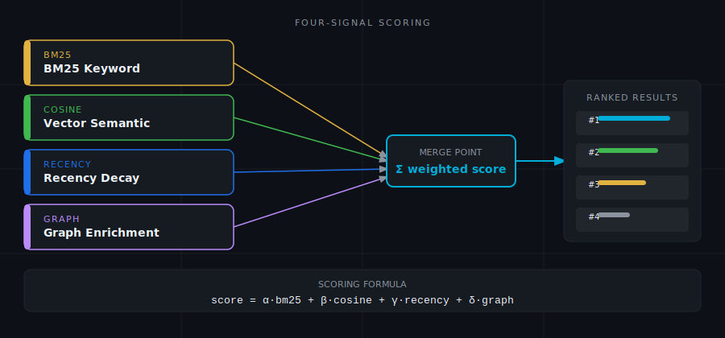
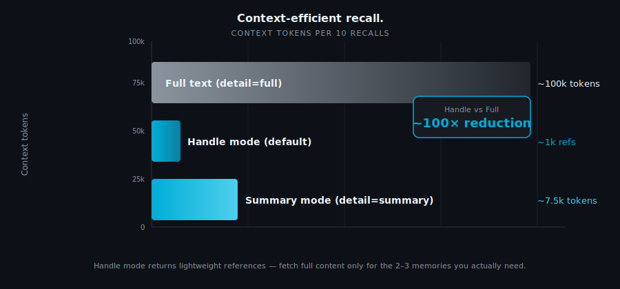
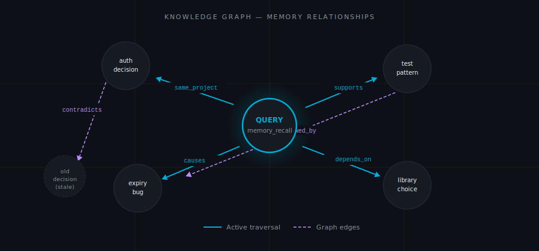

# How Engram Works

When you call `memory_recall`, here is what happens in the next 200 milliseconds.

Your query string hits four independent search paths simultaneously. Their scores are combined into a single ranked list. Graph neighbors of the top results are pulled in. The final list is returned — already filtered to the detail level you asked for.

That is the whole system. The rest of this page explains each step in enough depth that you can predict how Engram will behave in the edge cases that matter.

---

<p align="center"></p>

---

## The Four Search Signals

No single search strategy handles every case well. Keyword search fails when you remember the concept but not the exact term. Semantic search fails when you need precision — function names, error codes. Recency fails when the most relevant memory is six months old. That is why Engram runs four signals simultaneously and combines them, rather than picking one and hoping it fits.

### BM25 Keyword Search

PostgreSQL runs BM25 over a `tsvector` index built with Porter stemming. Think of it as a library catalog that has been taught that "authenticate" and "auth" and "authentication" are the same entry, and that "timeout" and "timed out" are close enough to list together.

Store a memory containing "authentication timeout under load" and later search "auth expiry" — the stemmer closes the gap. BM25 is fast (it is a standard index scan) and reliable for exact technical concepts: function names, error codes, flag names, file paths.

It does not understand meaning. "Database lock contention" and "WAL write blocked" look unrelated to BM25 even if they describe the same problem. That is what vector search is for.

### Vector Semantic Search

Every memory is chunked at sentence boundaries — not word limits, because splitting mid-sentence destroys the meaning of both halves. Each chunk is embedded into a 768-dimensional vector using the `nomic-embed-text` model served by Ollama.

At recall time your query is embedded by the same model and cosine distance finds the closest chunks. Two memories can share zero words and still be close neighbors in this space. Store "WAL mode timeout under concurrent writes," search "database lock contention" — different vocabulary, similar meaning, they surface together.

The embedding model runs locally. There is no external API call on the recall path. If Ollama is unreachable (restart, OOM, first-boot model download still in progress), Engram degrades gracefully: BM25 gets 0.85 weight and recency gets 0.15, and you get results.

### Recency Decay

Memories decay exponentially via `exp(-0.01 × hours)`. A memory stored today scores roughly 1300× higher on the recency signal than one stored a month ago — but a month-old memory still surfaces if nothing more recent is relevant.

Nothing is deleted. Old memories do not disappear — they step back. The decay is a weight, not a filter. If you have only one memory that matches a query, it surfaces regardless of age.

When you call `memory_correct`, both versions of the memory persist. The new version wins on recency and Engram creates a `supersedes` relationship between them in the knowledge graph. The old version stays queryable for audit purposes.

### Knowledge Graph Enrichment

After the three signals produce a scored list, the top results act as seeds for a graph traversal. Engram follows edges up to two hops and adds the neighbors to the result set — boosted slightly less than the seed memories, but present.

Store a bug report. Store the architectural pattern that caused it. Connect them with a `causes` edge. Now a query about the pattern automatically surfaces the bug, because the traversal follows the edge from pattern to bug. You do not need to remember to ask about both.

With that understanding of the four signals, you can read the scoring formula not as an opaque equation but as a record of how those trade-offs were balanced.

---

## The Scoring Formula

```
composite = (vector × W_v) + (bm25 × W_b) + (recency × W_r) + (precision × W_p)
final     = composite × importance_multiplier
```

Without embeddings available:

```
composite = (bm25 × 0.85) + (recency × 0.15)
```

Starting with v3.1, weights are stored per-project in the `weight_config` database table and loaded at server start (refreshed every 15 minutes). The compiled-in defaults — `W_v=0.45`, `W_b=0.30`, `W_r=0.10`, `W_p=0.15` — are used until a project's first row is written to `weight_config`. The adaptive weight tuner (see Background Workers) updates these values automatically based on accumulated failure-class events.

The defaults encode a specific view of what matters most. Vector search (0.45) leads because meaning-matching — finding the right concept across different vocabulary — is the hardest problem to solve by hand. When BM25 is doing most of the work, you feel it as precision: the function name you typed came back exactly. When cosine similarity is doing the work, you feel it as discovery: you found the memory you needed even though you did not remember how you described it. Recency (0.10) is intentionally light — it is a tiebreaker, not a filter. A three-month-old architectural decision should still surface when it is the only thing that explains why the code is the way it is.

The importance multiplier is set at store time and applied at recall time. It is a flat scaling factor — a `critical` memory with a mediocre composite score still beats a `trivial` memory with a strong one.

Two additional signals feed into the composite:

**Retrieval precision** (`times_useful / times_retrieved`) gets its own weight (0.15). New memories with fewer than 5 retrievals are scored at 0.5 — neutral, neither helped nor hurt.

**Dynamic importance** replaces the static importance multiplier for memories that have been retrieved and marked useful via `memory_feedback`. The system tracks a spaced-repetition schedule (`next_review_at`) and applies an extra boost to memories that are due for review. Once a memory accumulates retrieval history, `dynamic_importance` supersedes the initial static weight.

Both signals appear in the `score_breakdown` map returned with each result, so you can inspect exactly how a score was composed.

---

## Context-Efficient Recall

Context windows are not unlimited. An agent that pulls back ten full memories per session — each five thousand characters — burns forty percent of its available context on recall before writing a line of code. That is the problem the `detail` parameter solves.

The `detail` parameter controls how much text comes back per memory.

| `detail=`         | What you get                          | Typical size     | When to use                            |
| ----------------- | ------------------------------------- | ---------------- | -------------------------------------- |
| `"summary"` (default) | 1–2 sentence generated summary   | ~150 chars       | AI agents — preserve context window    |
| `"chunk"`         | The matched excerpt                   | ~200 chars       | When the specific passage that matched matters |
| `"full"`          | Original content                      | 200–50,000 chars | Export, debugging, full fidelity       |

Summaries are generated asynchronously by a background goroutine. When you store a new memory, the summary is not immediately available — the goroutine picks it up within 30 seconds. Until then, `detail="summary"` falls back to the matched chunk, which is a reasonable approximation.

At scale, summary mode reduces context consumption by roughly 13× compared to full mode. For an agent that recalls 10 memories per session, that is the difference between using 5% of a context window and using 65%.

<p align="center"></p>

### Handle Mode

Summary mode reduces the size of each result. Handle mode goes further — it does not return content at all. It returns lightweight references instead, leaving the agent in charge of which memories actually deserve context space.

When an agent calls `memory_recall`, the default response contains full memory objects (content, scores, metadata). For high-volume sessions, this inflates context. Handle mode returns lightweight references instead:

```json
{
  "handles": [
    {"id": "mem-abc123", "summary": "Auth token refresh logic", "score": 0.91, "memory_type": "pattern"},
    {"id": "mem-def456", "summary": "Postgres connection pool timeout", "score": 0.87, "memory_type": "error"}
  ],
  "count": 2,
  "fetch_hint": "call memory_fetch with id and detail=summary|chunk|full"
}
```

Handle mode is the **default** since the A6 configuration change. To get full content, pass `mode="full"` explicitly or set `ENGRAM_RECALL_DEFAULT_MODE=full`.

To expand a specific handle into full content, call `memory_fetch` with the ID and the desired detail level:

| `detail=` | Returns |
|-----------|---------|
| `"summary"` | 1–2 sentence generated summary |
| `"chunk"` | The matched chunk text |
| `"full"` | Complete original content |

Handle mode trades recall immediacy for context efficiency: an agent can scan 20 handles for ~1 KB, then fetch only the 2–3 memories it actually needs.

### Memory Explore: Iterative Synthesis

Sometimes you do not know what you are looking for. You have a question — "why does the connection pool timeout under load?" — and you need the system to go find the answer rather than hand you a list of candidates to reason over yourself. That is what `memory_explore` is for.

`memory_explore` answers open-ended questions by running multiple rounds of recall, scoring confidence after each round, and stopping when it has enough signal to synthesize an answer — or after a configured maximum number of iterations.

The loop:
1. Recall memories relevant to the question.
2. Score confidence (0–1): "Do I have enough signal to answer well?"
3. If confidence ≥ 0.8 (or iterations exhausted): synthesize an answer grounded in the recalled memories.
4. If confidence < 0.8: refine the query and repeat from step 1.

The result is a single synthesis response:
```json
{
  "answer": "The connection pool is configured at 10 max connections...",
  "sources": ["mem-abc123", "mem-def456"],
  "confidence": 0.92,
  "iterations": 2
}
```

**When to use `memory_explore` vs `memory_recall`:**

| Use case | Tool |
|----------|------|
| You know what you're looking for | `memory_recall` — single fast lookup |
| Open-ended question, uncertain what's stored | `memory_explore` — iterative synthesis |
| You need a synthesized answer, not a list of memories | `memory_explore` |
| You want raw memory objects to reason over yourself | `memory_recall` with `mode="full"` |

Configuration env vars: `ENGRAM_EXPLORE_MAX_ITERS` (default 5), `ENGRAM_EXPLORE_MAX_WORKERS` (default 8), `ENGRAM_EXPLORE_TOKEN_BUDGET` (default 20000).

### Importance Multipliers

Five levels, applied as multipliers on the final composite score. The formula is `(5 - importance_level) / 3.0`:

- **Critical (1.67×):** Non-negotiable constraints. "Never use raw SQL outside the Repository layer." These always surface near the top.
- **High (1.33×):** Key decisions that should stay visible for weeks or months. Architecture choices, major trade-offs.
- **Medium (1.0×):** The baseline. Most memories belong here.
- **Low (0.67×):** Notes you want to keep but do not need to see unless you specifically search for them.
- **Trivial (0.33×):** Ephemeral observations. Auto-pruned after 30 days if never accessed.

Set `critical` sparingly. If everything is critical, nothing is.

---

## Knowledge Graph

The scoring formula gets you the right memories. The knowledge graph gets you the memories adjacent to the right memories — the ones you did not know to ask for.

Engram tracks eleven relationship types between memories:

| Relationship    | Meaning                                        | Example                                         |
| --------------- | ---------------------------------------------- | ----------------------------------------------- |
| `caused_by`     | This memory exists because of that one         | Bug → the pattern that introduced it            |
| `relates_to`    | Adjacent context, no causal direction          | Two components that interact                    |
| `depends_on`    | This memory requires that one to be valid      | Feature decision → infrastructure prerequisite |
| `supersedes`    | This memory replaces that one                  | Corrected decision → original (now stale) one   |
| `used_in`       | This memory is applied in that context         | Pattern → the modules that apply it             |
| `resolved_by`   | Problem resolved by the referenced memory      | Bug → the fix that closed it                    |
| `contradicts`   | Conflict or tension                            | New finding → prior assumption                  |
| `supports`      | Evidence or reinforcement                      | Test pattern → the principle it validates       |
| `derived_from`  | Citation chain — memory derived from another   | Summary → the source document                   |
| `part_of`       | Hierarchical containment                       | Sub-decision → the larger architectural choice  |
| `follows`       | Temporal or sequential ordering                | Step 2 → Step 1 in a migration runbook          |

Edges have weights between 0.0 and 1.0, starting at 1.0 and decaying over time with `memory_consolidate`. When `memory_feedback` marks a recalled memory as useful, the edges that surfaced it are strengthened. Edges that fall below 0.1 are pruned.

Two-hop traversal means: a query returns a memory, that memory's neighbors are added, and so are the neighbors of those neighbors. Three degrees of separation from your query. This is enough to surface the bug caused by a pattern you queried, and the test that validates the fix for the bug — in a single call.

The graph does not require manual maintenance to stay useful. It self-optimizes toward what your queries actually find relevant, over time.

<p align="center"></p>

---

## Episodic Memory

Every SSE connection automatically starts an episode in the `global` project. When Claude Code connects to Engram, a new episode is created with a description like `"Claude Code session 2026-04-11T14:30:00Z"`. This requires no manual call to `memory_episode_start`.

Episodes group memories from a session together, making it easy to review everything that happened in a specific working session:

```python
# List recent sessions
memory_episode_list(project="global")

# Recall all memories from a specific session
memory_episode_recall(episode_id="ep-id-here", project="global")
```

Manual episode management is still available. `memory_episode_start` creates an explicitly named episode — useful for marking the start of a specific task. `memory_episode_end` closes it with an optional summary. Memories stored while an episode is open are tagged with its ID.

---

## Background Workers

Four goroutines start with the server and run on a fixed tick. You never configure them — they are always running.

**Summarizer (60-second tick):** Finds memories with no generated summary, calls the configured model (Ollama `llama3.2` by default, or Claude if `ENGRAM_CLAUDE_SUMMARIZE=true`), stores the result back. Without the summarizer, `detail="summary"` would always fall back to the matched chunk — a reasonable approximation, but not a compressed representation of the full memory. The goroutine logs failures but does not crash — a memory without a summary is not a broken memory.

**Re-embedder (30-second tick):** Finds chunks with NULL embedding vectors — new memories not yet embedded, or chunks from a pre-embedding migration. Calls Ollama's embedding endpoint and fills them in. Without the re-embedder, every new memory would be invisible to vector search until the server restarted. On first start it may take a few minutes to process a large existing store.

**Audit worker (`ENGRAM_AUDIT_INTERVAL`, default `168h`):** Runs all active canonical queries for each project, snapshots the ordered result IDs into `audit_snapshots`, and computes RBO and Jaccard similarity versus the prior snapshot. Fires an alert flag on results with RBO below 0.7. The first snapshot for a query establishes the baseline — no comparison is possible until the second run. Use `memory_audit_run` to trigger an immediate pass outside the tick.

**Weight tuner (`ENGRAM_WEIGHT_INTERVAL`, default `168h`):** Reads `retrieval_events` failure-class aggregates for the last 30 days. If ≥ 50 events exist and the dominant failure class maps to a weight adjustment, it updates `weight_config` for the project, stores a record in `weight_history`, and waits at least 7 days before the next adjustment. Guardrails prevent any single weight from leaving its bounded range. Use `memory_weight_history` to inspect current weights and the full adjustment log.

---

## Memory Types

Six types let agents and queries filter by context.

| Type           | Use it for                                  | Example                                                        |
| -------------- | ------------------------------------------- | -------------------------------------------------------------- |
| `decision`     | Choices made and their reasoning            | "Chose PostgreSQL — needed JSONB and array columns"            |
| `pattern`      | Recurring code or architecture patterns     | "All DB access goes through Repository, never raw SQL"         |
| `error`        | Bugs, gotchas, known failures               | "Port 3000 taken on this server — always use 3001"             |
| `context`      | General project or environment facts        | "Running Ubuntu 22.04, K8s on 3 nodes"                        |
| `architecture` | System design, data flow, component layout  | "Auth: client → /api/login → JWT (RS256) → httpOnly cookie"   |
| `preference`   | Style and convention preferences            | "Always tabs, 120-char lines, no trailing commas"              |

Filtering by type is a hard filter, not a weight. `memory_recall("database", memory_types=["error"])` returns only errors — nothing of any other type, regardless of relevance score.

Use types consistently. The value compounds: once you have stored 50 `error` memories, querying them by type before starting a debugging session gives you a cheap checklist of everything that has gone wrong before.

---

## Large Document Storage

`memory_store_document` and `memory_ingest` store documents by size tier. The tier is selected automatically — no configuration required.

| Tier | Size range | Storage strategy |
|------|-----------|-----------------|
| **Tier-0** (small) | ≤ ~500 KB | Stored verbatim in `Memory.Content`. Standard chunking and embedding. |
| **Tier-1** (synopsis) | 500 KB – 8 MB | A synopsis (first 8 KB + outline of headings) is stored as `Memory.Content`. The full body is chunked and embedded for semantic recall. The synopsis keeps context consumption manageable while recall stays grounded in the full document. |
| **Tier-2** (raw document) | 8 MB – 50 MB | Synopsis stored as memory. Full raw body parked in a separate `documents` table and linked via `document_id`. Chunks are NOT generated inline — instead, use `memory_query_document` to run regex, substring, or semantic searches against the raw body. |
| **Rejected** | > 50 MB | Returns an error. Use chunked streaming ingest (`memory_ingest` with `action=start/append/finish`) to split the payload and stay under the cap. |

**Querying large documents:** For Tier-2 memories, call `memory_query_document` with the memory ID and a question. It extracts relevant spans from the raw body and synthesizes an answer:

```python
memory_query_document(
    project="myproject",
    memory_id="mem-abc123",
    question="What are the retry backoff parameters?",
    filter={"substrings": ["retry", "backoff"]},
    window_chars=4000
)
```

Tier boundaries are configurable via `ENGRAM_MAX_DOCUMENT_BYTES` (Tier-1/Tier-2 boundary, default 8 MB) and `ENGRAM_RAW_DOCUMENT_MAX_BYTES` (Tier-2 cap, default 50 MB).

**Full architecture reference:** [Document Storage Strategy](https://www.petersimmons.com/engram/document-storage-strategy/) — ingest path, retrieval paths, design decisions, and bibliography in a single illustrated page.

---

## Configuration Reference

All Engram configuration is via environment variables (not CLI flags — secrets in flags are visible in `/proc/cmdline`).

| Variable | Default | Description |
|----------|---------|-------------|
| `DATABASE_URL` | (required) | PostgreSQL DSN |
| `ENGRAM_API_KEY` | (required) | Bearer token for MCP endpoint authentication |
| `ANTHROPIC_API_KEY` | — | Enables Claude-powered features (explore synthesis, re-ranking, consolidation) |
| `OLLAMA_URL` | `http://ollama:11434` | Ollama embedding server |
| `ENGRAM_OLLAMA_MODEL` | `nomic-embed-text` | Embedding model (must produce 768-dim vectors) |
| `ENGRAM_PORT` | `8788` | MCP SSE port |
| `ENGRAM_HOST` | `0.0.0.0` | Bind address |
| `ENGRAM_RECALL_DEFAULT_MODE` | `handle` | Default recall mode: `handle` (references) or `full` (complete objects) |
| `ENGRAM_EXPLORE_MAX_ITERS` | `5` | Maximum iterations for `memory_explore` |
| `ENGRAM_EXPLORE_MAX_WORKERS` | `8` | Parallel recall workers per explore iteration |
| `ENGRAM_EXPLORE_TOKEN_BUDGET` | `20000` | Token budget for explore synthesis |
| `ENGRAM_MAX_DOCUMENT_BYTES` | `8388608` (8 MB) | Tier-1/Tier-2 boundary for document ingest |
| `ENGRAM_RAW_DOCUMENT_MAX_BYTES` | `52428800` (50 MB) | Maximum document size before rejection |
| `ENGRAM_FETCH_MAX_BYTES` | `65536` (64 KB) | Byte cap for `memory_fetch` with `detail=full` |
| `ENGRAM_SUMMARIZE_MODEL` | `llama3.2` | Ollama model for background summarization |
| `ENGRAM_SUMMARIZE_ENABLED` | `true` | Enable background summarization worker |
| `ENGRAM_CLAUDE_SUMMARIZE` | `false` | Use Claude instead of Ollama for summarization |
| `ENGRAM_CLAUDE_CONSOLIDATE` | `false` | Use Claude for near-duplicate detection in consolidation |
| `ENGRAM_CLAUDE_RERANK` | `false` | Enable Claude re-ranking of recall results |
| `ENGRAM_DECAY_INTERVAL` | `8h` | How often the importance decay worker runs |
| `ENGRAM_AUDIT_INTERVAL` | `168h` | How often the decay audit worker snapshots canonical queries |
| `ENGRAM_WEIGHT_INTERVAL` | `168h` | How often the adaptive weight tuner checks failure-class aggregates |

---

## What Engram Does Not Do

It does not delete memories on correction — it supersedes them. It does not forget on shutdown — everything is in PostgreSQL. It does not require a working Ollama to return results — BM25 and recency keep working. It does not enforce uniqueness — you can store the same fact twice; the graph and recency will naturally surface whichever version is newer.

---

**Next:** [Getting Started](getting-started.md) — running in five minutes.
