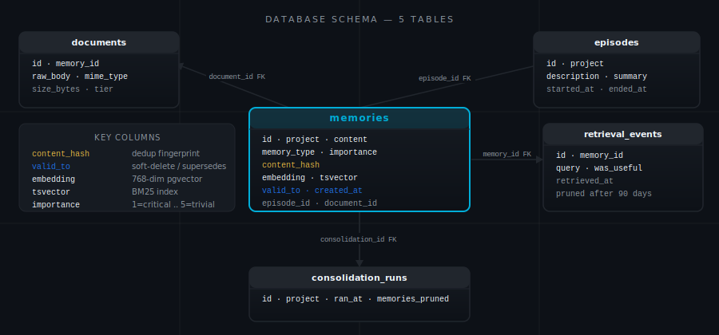
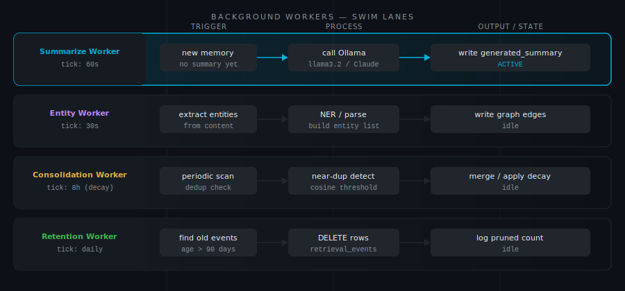

# Operations

Your memory store is not code. You cannot reconstruct it from a git repository. The architectural decisions you recorded six weeks ago, the debugging patterns you accumulated across a dozen incidents, the project context that lets your AI assistant hit the ground running — none of that exists anywhere else. It lives in the PostgreSQL volume. This page covers the four practices that keep it there: backup, security, data portability, and diagnostics.

---

## Backup

One backup command stands between you and losing all of it.

The data lives in a Docker named volume (`engram_pgdata`). Back it up with a `pg_dump` piped to a compressed file:

```bash
mkdir -p backups
docker exec engram-postgres pg_dump -U engram engram | gzip > backups/engram-$(date +%Y%m%d).sql.gz
```

Keep the last 7 days. The entire backup for a typical memory store — a few hundred memories, their chunks, and graph edges — is 1–5 MB. Storage is not the constraint.

**Restore:**

```bash
gunzip -c backups/engram-20260101.sql.gz | docker exec -i engram-postgres psql -U engram engram
```

---

## The One Command That Destroys Data

```bash
docker compose down -v   # ← destroys all data
docker compose down      # ← safe — stops containers, keeps data
```

The `-v` flag deletes Docker named volumes. This is the single most common way an Engram store is lost — someone copies a teardown command from a tutorial, does not notice the flag, and runs it. The volumes are gone in under a second. PostgreSQL data, embedding vectors, knowledge graph edges, everything.

`docker compose down` stops containers and leaves your PostgreSQL data intact. `docker compose down -v` does not.

There is no recovery from `-v` without a backup. The flag exists for development resets — it is useful when you want to start completely fresh in a test environment. In a production instance that holds months of accumulated context, it should never appear in a runbook.

---

## HTTP Endpoints

These are the server's internal API. Most users never call them directly — `make setup` and the Docker health checks handle them automatically. But they are useful to know when you are debugging a startup problem or building an integration.

**`GET /health`** — returns `{"status":"ok"}` with no authentication required. Used for Docker healthchecks and external readiness probes:

```bash
curl http://localhost:8788/health
```

**`GET /setup-token`** — returns the current bearer token, SSE endpoint URL, and server name as JSON. Localhost-only (accepts loopback `127.0.0.1` / `::1` and RFC1918 Docker bridge addresses; rejects all others). Used by `make setup` to configure MCP clients without manual copy-paste.

**Request:**
```bash
curl http://localhost:8788/setup-token
```

**Response (200 OK):**
```json
{
  "token": "64-char-hex-bearer-token",
  "endpoint": "http://127.0.0.1:8788/sse",
  "name": "engram"
}
```

**Rate limit:** 3 requests per 5 minutes per IP. Exceeding this returns `429 Too Many Requests`.

**Error responses:**
- `403 Forbidden` — Request from an address outside loopback/RFC1918. Use `127.0.0.1` from localhost, or set `ENGRAM_SETUP_TOKEN_ALLOW_RFC1918=1` if outside Docker.
- `429 Too Many Requests` — Rate limit exceeded. Call this endpoint once during setup, then use the token in your IDE config.

All other routes (`/sse`, memory operation POSTs) require `Authorization: Bearer <token>`.

---

## Security

The security design follows a single principle: assume the machine running Engram is yours, but not everything on the machine is trustworthy. Each layer of the security model addresses a specific threat.

**Network exposure:** The default host binding in `docker-compose.yml` is `127.0.0.1:8788:8788`. The port is not reachable outside the machine without explicitly changing this binding or adding a reverse proxy. No firewall rules are needed for local use. A process elsewhere on your network cannot reach your memory store.

**Authentication:** `ENGRAM_API_KEY` is required — the server refuses to start without it. `make init` generates a strong 32-byte hex token automatically. Every SSE connection must present `Authorization: Bearer <token>`. Connections without it are rejected with `401 Unauthorized`. Other local processes cannot read your memories by making requests to the port — they need the token.

```bash
# .env — generated by make init
ENGRAM_API_KEY=<64-char-hex-token>
```

For Claude Code, `make setup` configures the token automatically. For other clients, copy the value from `.env` and add it as a header in your IDE's MCP config.

**Claude API key:** Never logged. Never stored in the database. Used only in memory within the running process, passed directly to the Anthropic SDK.

**Data at rest:** PostgreSQL data lives in a Docker named volume, not encrypted by default. If you need encryption at rest, mount the volume on an encrypted filesystem at the host level. There is no in-application encryption option.

**Secrets cleared from environment:** `ENGRAM_API_KEY`, `ANTHROPIC_API_KEY`, and `DATABASE_URL` are unset from the process environment immediately after being read at startup. Go subprocesses spawned by the server will not inherit these values.

**Container hardening defaults:** The `docker-compose.yml` applies the following to the `engram-go-app` service: `mem_limit: 512m` (OOM-kill rather than unbounded growth), `pids_limit: 512` (fork bomb mitigation), `security_opt: no-new-privileges:true`. Both `engram-go` and `ollama` ports are bound to `127.0.0.1` only — not reachable from outside the machine without explicit proxy configuration. If you hit OOM kills under heavy ingest load, raise `mem_limit` in `docker-compose.yml`.

**`ENGRAM_TRUST_PROXY_HEADERS`:** When Engram is behind a reverse proxy (nginx, Traefik, Caddy), set `ENGRAM_TRUST_PROXY_HEADERS=1` in `.env`. This enables the server to read the real client IP from `X-Forwarded-For` / `X-Real-IP` headers for rate limiting and `/setup-token` locality checks. Default is `false` — leave it off unless you have a trusted proxy in front.

> **Security note:** Enabling this flag without a trusted L7 proxy in front allows any client with the Bearer token to supply an arbitrary `X-Forwarded-For` header, bypassing per-IP rate limiting. The Bearer token requirement still applies — this is not an authentication bypass.

---

## Data Portability

You are not locked in. Everything Engram stores can be exported as plain markdown files and read without Engram installed.

**Export all memories for a project:**

```python
memory_export_all(project="my-app", output_dir="/tmp/export")
```

Output: a directory of `.md` files with YAML frontmatter. Each file contains one memory — its content, type, tags, importance, timestamps, and SHA-256 hash. Greppable. Diffable. Committable to git.

**Import from another instance or from existing documentation:**

```python
# Ingest a documentation directory
memory_ingest(path="/path/to/docs/", project="my-app")

# Import a CLAUDE.md file
memory_import_claudemd(content=claude_md_text, project="my-app")
```

---

## Database Schema

Five tables, each playing a specific role in how memories are stored, searched, and related to each other.

| Table | Purpose |
|---|---|
| `memories` | Core records: content, type, tags, importance, summary, SHA-256 hash |
| `memory_fts` | PostgreSQL `tsvector` full-text search index (BM25) |
| `chunks` | Content chunks with vector embeddings (768-dim float32 array) |
| `relationships` | Knowledge graph edges: source, target, type, weight, created_at |
| `project_meta` | Per-project metadata: embedder lock, migration state |
| `retrieval_events` | Per-recall event log for retrieval quality metrics. Rows older than 90 days are purged automatically by the retention worker. |

`memories` is the source of truth — every stored context record lives here. `chunks` holds the embedding vectors that power semantic search; each memory splits into sentence-boundary chunks so vector similarity operates on coherent units of meaning rather than arbitrary word windows. `relationships` is the knowledge graph — edges between memories that let Engram surface related context you did not explicitly search for. `memory_fts` gives you BM25 keyword search alongside vector search, so precise terminology matches survive even when semantic distance is large. `retrieval_events` is the feedback loop — every recall query logged here feeds the quality metrics that tell you whether your memory store is actually helping.

The `pgvector` extension provides the `<=>` cosine distance operator for vector similarity search. Chunks are split at sentence boundaries to preserve semantic coherence — splitting at word limits would destroy the meaning of both halves of a sentence.

The SHA-256 hash in `memories` is a content integrity check. `memory_verify` compares stored hashes against current content to detect silent corruption.

<p align="center"></p>

<p align="center"></p>

---

## Logs and Diagnostics

```bash
# Check container state
docker compose ps

# Application logs — last 50 lines
docker compose logs engram-go-app --tail=50

# PostgreSQL logs
docker compose logs engram-postgres --tail=20

# Memory count — quick health check
docker exec engram-postgres psql -U engram -d engram -c "SELECT COUNT(*) FROM memories;"

# Confirm the SSE endpoint is responding
curl -s http://localhost:8788/sse
```

If the SSE endpoint returns nothing or hangs, check whether the Go container started correctly (`docker compose ps`) and whether PostgreSQL is accepting connections (`docker compose logs engram-postgres`). Most startup failures are PostgreSQL not finishing its initialization before the Go process tries to connect — restart with `docker compose restart engram-go-app` once PostgreSQL is ready.

---

## Switching Embedding Models

Once a project stores its first embedding, that project is locked to the embedding model used for that chunk. This is a deliberate constraint: mixing embeddings from different models in the same index produces nonsense similarity scores. The models live in different geometric spaces.

To switch models for a project:

```python
memory_migrate_embedder(project="my-app", new_model="mxbai-embed-large")
```

This triggers a background re-embedding. The re-embedder goroutine runs on a 30-second tick and processes chunks in batches. BM25 and recency continue working immediately. Vector search returns partial or degraded results until re-embedding is complete.

Migration speed depends on project size and hardware. On CPU, a 200-memory store typically finishes in a few minutes. On GPU, faster. Watch the application logs to track progress. Do not start a migration and then stop the container — the goroutine picks up where it left off on restart, but a half-migrated store is slower to query.

---

## Running Multiple Projects

One Engram instance serves any number of projects. Each project is isolated — `project="frontend"` and `project="backend"` share the server, the PostgreSQL instance, and the Ollama connection, but not their memories, graph edges, or embedder lock.

`project="global"` is readable by all projects. Use it for cross-project conventions, shared security rules, or any context that every agent working on the system should see.

There is no limit on the number of projects. The operational cost of adding a project is a few rows in `project_meta` and whatever memories you store.

---

## Background Workers

Five goroutines start with the server and run continuously. They are always on and require no configuration. A sixth — the entity extraction worker — starts only when `ANTHROPIC_API_KEY` is set and `ENGRAM_ENTITY_PROJECTS` is non-empty. Here is what each one does and what degrades without it.

**Summarizer (60-second tick):** Finds memories without generated summaries and calls the configured model — Ollama by default, Claude Haiku if `ENGRAM_CLAUDE_SUMMARIZE=true`. Without the summarizer, `detail="summary"` requests fall back to matched chunks, which are accurate but longer and less synthesized. Failures are logged but do not crash the worker — a memory without a summary is not broken, it just returns slightly more verbose results.

**Re-embedder (30-second tick):** Finds chunks with null embedding vectors and fills them in. Without the re-embedder, new memories would be stored but invisible to semantic search — you could recall them by keyword or recency, but vector similarity would not find them. This goroutine also handles chunks from an in-progress model migration. It runs until there is nothing left to embed, then idles.

**Retention worker (24-hour tick):** Deletes `retrieval_events` rows older than 90 days. Runs once immediately at startup (catch-up pass) and then every 24 hours. Logs `rows_deleted` at INFO. Without the retention worker, the `retrieval_events` table grows without bound — every recall query adds a row, and over months of use that table becomes a significant fraction of your database size. The 90-day window keeps retrieval quality metrics meaningful (recent feedback matters more than old feedback) while keeping the table bounded without manual maintenance. Note: `memory_aggregate(by="failure_class")` and retrieval quality metrics do not see events older than 90 days.

**Audit worker (`ENGRAM_AUDIT_INTERVAL`, default 6h):** Re-runs canonical queries registered via `memory_audit_add_query` and records ranking snapshots. Detects retrieval drift — when the same query returns different results over time — and surfaces it via `memory_audit_compare`. Without the audit worker, ranking drift accumulates silently; you only notice it when recall quality degrades.

**Weight tuner (`ENGRAM_WEIGHT_INTERVAL`, default 24h):** Reads per-project failure-class event aggregates and adjusts the four retrieval signal weights (vector, BM25, recency, precision) toward better performance. Without the weight tuner, weights remain at compiled defaults for all projects regardless of their retrieval patterns. Use `memory_weight_history` to inspect the current weights and tuning history.

**Entity extraction worker (conditional — one goroutine per project in `ENGRAM_ENTITY_PROJECTS`):** Polls the extraction job queue and uses Claude to identify named entities and relations, building the GraphRAG entity index for each project. Only starts when `ANTHROPIC_API_KEY` is set and `ENGRAM_ENTITY_PROJECTS` is non-empty. Without it, entity-graph enrichment does not run — `memory_recall` still works, but graph-based connections between entities are not automatically inferred.

---

## Hooks and the Instinct Consolidator

The `hooks/` directory contains optional Claude Code hooks that capture tool calls to a local buffer and periodically trigger a companion project called **instinct** to consolidate them into Engram memories.

**What `hooks/post-tool-use.sh` does:** After every Claude Code tool call, this hook reads the tool call JSON from stdin, filters for meaningful write operations (file edits, shell commands, MCP write tools), and appends a hashed event record to a local JSONL buffer at `~/.local/state/instinct/buffer.jsonl`. Every N events (default: 20), it spawns the instinct consolidator in the background to process the buffer and store distilled context into Engram.

**What `consolidator/` is:** The `consolidator/` directory is the source tree for a companion project called **instinct** (`consolidator/instinct/`). Instinct reads the tool-call buffer and uses Claude to extract patterns, decisions, and context worth storing as memories. It is a separate project from the core Engram server and is **not required** for the server to run. Engram works fully without it — hooks and instinct are an optional productivity layer on top of the core MCP server.

**Why the hook references `$HOME/projects/instinct/consolidator`:** The instinct consolidator is expected to live at `~/projects/instinct/consolidator` as a separate companion repository, not inside this repo. The `consolidator/` directory here is its source; the hook assumes you have cloned or installed it at that path.

**How to install:**

```bash
bash hooks/install.sh
```

`install.sh` copies the hook scripts to `~/.claude/hooks/`, registers them in `~/.claude/settings.json`, and sets up the Python venv in `consolidator/`. It is idempotent — safe to run multiple times. To disable the hooks without uninstalling them, set `INSTINCT_ENABLED=0` in your environment.

---

**Previous:** [Claude Advisor](claude-advisor.md) | **Home:** [README](../README.md)
