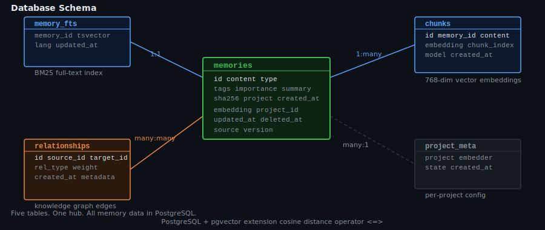

# Operations

Most tools die not from being useless but from being unreliable. You miss a backup, you run the wrong `docker compose` flag, and suddenly the context you spent three months accumulating is gone. This page covers the four things that keep a production Engram instance healthy: backup, security, data portability, and basic diagnostics.

---

## Backup

The data lives in a Docker named volume (`engram_pgdata`). The simplest backup is a `pg_dump` piped to a compressed file:

```bash
docker exec engram-postgres pg_dump -U engram engram | gzip > backups/engram-$(date +%Y%m%d).sql.gz
```

Or use the included script:

```bash
bash bin/backup-postgres.sh
```

Keep the last 7 days. The entire backup for a typical memory store — a few hundred memories, their chunks, and graph edges — is 1–5 MB. Storage is not the constraint.

**Restore:**

```bash
gunzip -c backups/engram-20260101.sql.gz | docker exec -i engram-postgres psql -U engram engram
```

---

## The One Command That Destroys Data

```bash
docker compose down -v   # ← destroys all data
docker compose down      # ← safe — stops containers, keeps data
```

The `-v` flag deletes Docker named volumes. This is the single most common way an Engram store is lost. `docker compose down` stops containers and leaves your PostgreSQL data intact. `docker compose down -v` does not.

There is no recovery from `-v` without a backup. The flag exists for development resets. In production, it should never appear in a runbook.

---

## Security

**Network exposure:** The default host binding in `docker-compose.yml` is `127.0.0.1:8788:8788`. The port is not reachable outside the machine without explicitly changing this binding or adding a reverse proxy. No firewall rules are needed for local use.

**Authentication:** Set `ENGRAM_API_KEY` in your `.env` to require `Authorization: Bearer <key>` on every connection. Without this, any process on localhost can connect without credentials.

```bash
# .env
ENGRAM_API_KEY=your-key-here
```

```python
# Client configuration
claude mcp add engram --transport sse http://localhost:8788/sse --header "Authorization: Bearer your-key-here"
```

**Claude API key:** Never logged. Never stored in the database. Used only in memory within the running process, passed directly to the Anthropic SDK.

**Data at rest:** PostgreSQL data lives in a Docker named volume, not encrypted by default. If you need encryption at rest, mount the volume on an encrypted filesystem at the host level. There is no in-application encryption option.

---

## Data Portability

You are not locked in. Everything Engram stores can be exported as plain markdown files and read without Engram installed.

**Export all memories for a project:**

```python
memory_export_all(project="my-app", output_dir="/tmp/export")
```

Output: a directory of `.md` files with YAML frontmatter. Each file contains one memory — its content, type, tags, importance, timestamps, and SHA-256 hash. Greppable. Diffable. Committable to git.

**Import from another instance or from existing documentation:**

```python
# Ingest a documentation directory
memory_ingest(path="/path/to/docs/", project="my-app")

# Import a CLAUDE.md file
memory_import_claudemd(content=claude_md_text, project="my-app")
```

---

## Database Schema

Five tables:

| Table | Purpose |
|---|---|
| `memories` | Core records: content, type, tags, importance, summary, SHA-256 hash |
| `memory_fts` | PostgreSQL `tsvector` full-text search index (BM25) |
| `chunks` | Content chunks with vector embeddings (768-dim float32 array) |
| `relationships` | Knowledge graph edges: source, target, type, weight, created_at |
| `project_meta` | Per-project metadata: embedder lock, migration state |

The `pgvector` extension provides the `<=>` cosine distance operator for vector similarity search. Chunks are split at sentence boundaries to preserve semantic coherence — splitting at word limits would destroy the meaning of both halves of a sentence.

The SHA-256 hash in `memories` is a content integrity check. `memory_verify` compares stored hashes against current content to detect silent corruption.

<p align="center"></p>

---

## Logs and Diagnostics

```bash
# Check container state
docker compose ps

# Application logs — last 50 lines
docker compose logs engram-go-app --tail=50

# PostgreSQL logs
docker compose logs engram-postgres --tail=20

# Memory count — quick health check
docker exec engram-postgres psql -U engram -d engram -c "SELECT COUNT(*) FROM memories;"

# Confirm the SSE endpoint is responding
curl -s http://localhost:8788/sse
```

If the SSE endpoint returns nothing or hangs, check whether the Go container started correctly (`docker compose ps`) and whether PostgreSQL is accepting connections (`docker compose logs engram-postgres`). Most startup failures are PostgreSQL not finishing its initialization before the Go process tries to connect — restart with `docker compose restart engram-go-app` once PostgreSQL is ready.

---

## Switching Embedding Models

Once a project stores its first embedding, that project is locked to the embedding model used for that chunk. This is a deliberate constraint: mixing embeddings from different models in the same index produces nonsense similarity scores. The models live in different geometric spaces.

To switch models for a project:

```python
memory_migrate_embedder(project="my-app", new_model="mxbai-embed-large")
```

This triggers a background re-embedding. The re-embedder goroutine runs on a 30-second tick and processes chunks in batches. BM25 and recency continue working immediately. Vector search returns partial or degraded results until re-embedding is complete.

Migration speed depends on project size and hardware. On CPU, a 200-memory store typically finishes in a few minutes. On GPU, faster. Watch the application logs to track progress. Do not start a migration and then stop the container — the goroutine picks up where it left off on restart, but a half-migrated store is slower to query.

---

## Running Multiple Projects

One Engram instance serves any number of projects. Each project is isolated — `project="frontend"` and `project="backend"` share the server, the PostgreSQL instance, and the Ollama connection, but not their memories, graph edges, or embedder lock.

`project="global"` is readable by all projects. Use it for cross-project conventions, shared security rules, or any context that every agent working on the system should see.

There is no limit on the number of projects. The operational cost of adding a project is a few rows in `project_meta` and whatever memories you store.

---

## Background Workers

Two goroutines start with the server and run continuously.

**Summarizer (60-second tick):** Finds memories without generated summaries and calls the configured model — Ollama by default, Claude Haiku if `ENGRAM_CLAUDE_SUMMARIZE=true`. Failures are logged but do not crash the worker. A memory without a summary is not broken; it falls back to the matched chunk when `detail="summary"` is requested.

**Re-embedder (30-second tick):** Finds chunks with null embedding vectors and fills them in. This goroutine handles both new memories waiting for their first embedding and chunks from an in-progress model migration. It runs until there is nothing left to embed, then idles.

Both workers are always on. Neither requires configuration.

---

**Previous:** [Claude Advisor](claude-advisor.md) | **Home:** [README](../README.md)
