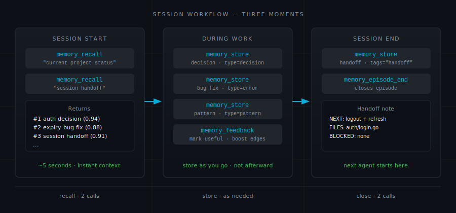
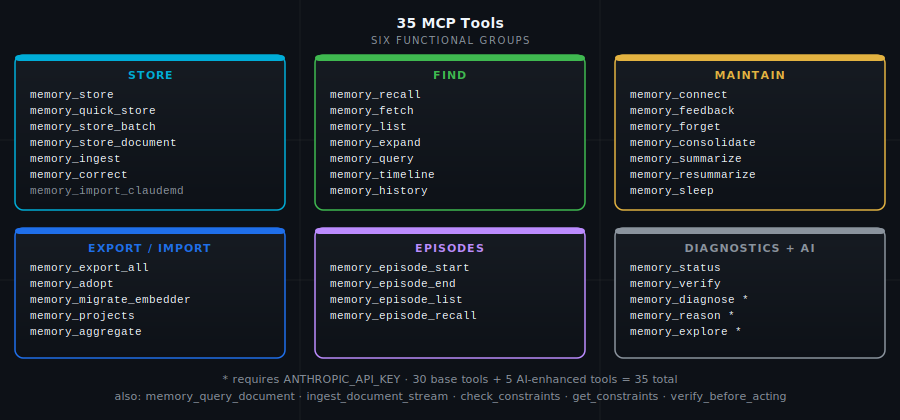

# All 43 Tools

You open a session. The codebase is the same as yesterday but you have no memory of it. Before writing a line, you need to know: what decisions did we make about auth? Are there any known bugs in this module? What was the next thing we planned to do?

Three calls answer that — one to recall recent context, one targeted at the work area, one to check if there is a handoff note from the last session. Everything else in this reference is about what you do with what you find.

<p align="center"></p>

<p align="center"></p>

---

## MCP Tool Profiles

By default, engram exposes **20 core tools** in its MCP surface. An additional 23 maintenance and operational tools are registered but hidden from `tools/list` — they do not appear in AI client context but remain callable via `POST /mcp tools/call`.

### Hidden Tools (callable but not listed)

These tools are best accessed via the bundled skills (see [Bundled Skills](#bundled-skills)):

| Group | Tools |
|-------|-------|
| Audit | memory_audit_add_query, memory_audit_list_queries, memory_audit_deactivate_query, memory_audit_run, memory_audit_compare, memory_weight_history |
| Embedder | memory_migrate_embedder, memory_embedding_eval, memory_models |
| Consolidation | memory_consolidate, memory_sleep, memory_summarize, memory_resummarize |
| Episodes | memory_episode_start, memory_episode_end, memory_episode_list, memory_episode_recall |
| Ingest/Export | memory_ingest, memory_import_claudemd, memory_ingest_document_stream, memory_ingest_export, memory_ingest_status, memory_export_all |
| Other | memory_expand, memory_adopt, memory_aggregate, memory_diagnose, memory_verify, memory_delete_project |

To call a hidden tool directly via HTTP:

```bash
xh POST "${ENGRAM_BASE_URL:-http://localhost:8788}/mcp" \
  "Authorization: Bearer $ENGRAM_API_KEY" \
  jsonrpc=2.0 id:=1 method=tools/call \
  params:='{"name":"memory_consolidate","arguments":{"project":"default"}}'
```

### Bundled Skills

Install the bundled Claude Code skills for progressive disclosure of maintenance operations:

```bash
make install-skills
```

Available skills after install:
- `/engram-consolidate` — memory consolidation and maintenance
- `/engram-episodes` — session/episode tracking  
- `/engram-ingest` — import/export operations
- `/engram-diagnose` — health and analytics

---

## The Session Pattern

Every session has three moments where Engram pays for itself.

**Start of session:** Recall before touching anything. A broad context recall followed by a targeted one for the area you are working in. Two calls, five seconds, and you know what you would otherwise spend twenty minutes re-discovering.

**During work:** Store decisions as you make them, not afterward. By the end of a session, memory of the reasoning fades. "We chose X" is worth half as much as "We chose X because Y, and Z was explicitly rejected."

**End of session:** Write a handoff note. The next session reads this first. Keep it short and specific:

```
SESSION HANDOFF: Completed OAuth2 login flow
NEXT: Logout endpoint + token refresh
BLOCKED: None
CHANGED: internal/auth/login.go, internal/auth/middleware.go
```

Store it as `memory_type="context"`, `importance=1`, `tags="handoff,session"`. The next session recalls it with `memory_recall("session handoff", project="my-app")`.

---

## Storing Memories

You need to put something in before you can get it back. These tools handle the write side — from a single observation to an entire documentation tree. The right tool depends on how much you are storing and whether you need it searchable at the paragraph level or whole-document level.

### memory_store

The standard tool. Up to 10,000 characters. Use it for decisions, bugs, patterns, and preferences — anything you would be frustrated to explain again next session.

```python
memory_store(
    content="Auth uses RS256 JWT. 24h expiry. Stored in httpOnly cookie. Do NOT use localStorage — XSS risk.",
    memory_type="decision",
    tags="auth,security,jwt",
    importance=1,
    project="my-app"
)
```

**importance** controls the scoring multiplier at recall time:

| Level | Value | Multiplier | Auto-pruned |
| ----- | ----- | ---------- | ----------- |
| Critical | 0 | 1.67× | Never |
| High | 1 | 1.33× | Never |
| Medium | 2 | 1.0× | Never |
| Low | 3 | 0.67× | Never |
| Trivial | 4 | 0.33× | After 30 days |

Set `importance=0` (Critical) sparingly. A constraint that must never be violated — never use raw SQL outside the repository layer, never store tokens in localStorage — belongs here. Most decisions belong at High or Medium. If everything is Critical, nothing is.

---

### memory_store_document

For large documents — up to 500,000 characters. Engram chunks at sentence boundaries automatically and embeds each chunk independently. Use this to ingest an entire architecture document, a long meeting transcript, or a codebase module you want the agent to be able to query.

```python
memory_store_document(
    content=entire_architecture_document,
    memory_type="architecture",
    project="my-app"
)
```

The difference from `memory_store` is not just size. Chunking means a 20,000-word document is searchable at the paragraph level — a query about authentication surfaces the auth section, not the whole document.

---

### memory_store_batch

Store several memories in a single call. More efficient than repeated single stores when loading an initial set of project context — the embedding calls are batched.

```python
memory_store_batch(
    memories=[
        {"content": "Use tabs, 120-char lines", "memory_type": "preference"},
        {"content": "DB on port 5433 (not default 5432)", "memory_type": "context"},
        {"content": "Never use localStorage for tokens", "memory_type": "pattern"}
    ],
    project="my-app"
)
```

Reach for this at session start when bootstrapping a project — loading ten context memories in one call is meaningfully faster than ten sequential stores.

---

## Finding What You Need

Storing is cheap. The value is in retrieval. These tools cover the range from precise targeted lookup to open-ended synthesis. Know which mode you are in before you call one — the right tool returns the right shape of answer.

### memory_recall

The main search tool. Runs four signals simultaneously — BM25 keyword, vector semantic, recency decay, and knowledge graph enrichment — and combines their scores into a single ranked list. See [How It Works](how-it-works.md) for the mechanics.

```python
# Default: top 5 results as summaries
memory_recall("authentication JWT", project="my-app")

# Full content, more results
memory_recall("authentication JWT", project="my-app", detail="full", limit=10)

# Claude re-ranking after retrieval (requires ENGRAM_CLAUDE_RERANK=true)
memory_recall("auth", project="my-app", rerank=True)
```

**detail** controls how much text comes back per result:

| Value | What you get | Typical size | When to use |
| ----- | ------------ | ------------ | ----------- |
| `"summary"` (default) | Generated 1–2 sentence summary | ~150 chars | AI agents — preserves context window |
| `"chunk"` | The matched excerpt | ~200 chars | When the specific passage matters |
| `"full"` | Original content | 200–50,000 chars | Export, debugging, full fidelity |

At scale, summary mode uses roughly 13× less context than full mode. For an agent recalling 10 memories per session, that is the difference between 5% of a context window and 65%.

You can filter by memory type. This is a hard filter — it excludes everything else regardless of relevance:

```python
memory_recall("database", project="my-app", memory_types=["error"])
# Returns only error-type memories. Good before a debugging session.
```

<p align="center"></p>

---

### memory_list

Browse without a query. Useful when you want to see what exists in a category rather than search for something specific.

```python
# All decisions for a project
memory_list(project="my-app", memory_type="decision", limit=20)

# Memories tagged security
memory_list(project="my-app", tags="security", limit=10)

# Critical and High only
memory_list(project="my-app", min_importance=0, max_importance=1)
```

Reach for this when you want to audit a category — "what decisions have we recorded so far?" — rather than retrieve something specific.

---

### memory_feedback

Tell the system which results were useful. Over time, this strengthens the graph edges between memories that surface together helpfully and weakens edges that lead to irrelevant results.

```python
memory_feedback(memory_ids="id1,id2,id3", helpful=True, project="my-app")
```

This is the only mechanism for the knowledge graph to learn from usage rather than from explicit connections you create. You do not have to call it — but projects where it is used regularly return better results over time.

---

## Maintaining Your Memory Store

Memory stores accumulate noise. Decisions get revised. Bugs get fixed and the old note stays around. These tools keep the store accurate and the graph healthy. Run them periodically rather than reactively — a well-maintained store retrieves cleanly; a neglected one surfaces stale results.

### memory_correct

Supersede wrong or outdated information. The old memory is not deleted — it persists as an audit record. The new memory wins on recency and the two are linked with a `supersedes` relationship in the knowledge graph.

```python
memory_correct(
    memory_id="old-decision-id",
    new_content="Auth now uses RS256 + RS512 fallback — see migration note in internal/auth/README.",
    project="my-app"
)
```

Use `memory_correct` rather than `memory_forget` when you want to track that a change happened and why. If you just need a record gone — because it contains wrong security advice or outdated credentials — use `memory_forget`.

---

### memory_forget

Hard delete. Removes the memory and all its graph edges. Use when keeping the information is actively harmful, not merely outdated.

```python
memory_forget(memory_id="id-here", project="my-app")
```

---

### memory_connect

Explicitly link two memories with a typed relationship. The knowledge graph traversal follows these edges at recall time — connect a decision to the bug it caused, and querying the decision surfaces the bug.

```python
memory_connect(
    source_id="auth-decision-id",
    target_id="session-bug-id",
    rel_type="causes",
    weight=0.9,
    project="my-app"
)
```

**Relationship types:**

| Type | Meaning |
| ---- | ------- |
| `caused_by` | This memory exists because of that one |
| `relates_to` | Adjacent context, no causal direction |
| `depends_on` | This memory requires that one to be valid |
| `supersedes` | This memory replaces that one |
| `used_in` | This memory is applied in that context |
| `resolved_by` | Problem resolved by the referenced memory |
| `contradicts` | Conflict or tension |
| `supports` | Evidence or reinforcement |
| `derived_from` | Citation chain — memory derived from another |
| `part_of` | Hierarchical containment |
| `follows` | Temporal or sequential ordering |

Weights range from 0.0 to 1.0. Edges start at 1.0 and decay over time. `memory_consolidate` prunes edges below 0.1. `memory_feedback` strengthens edges when the connections they represent prove useful.

---

### memory_consolidate

Housekeeping. Run it periodically — monthly for active projects, before a major onboarding, or when recall quality starts to feel noisy.

What it does: deduplicates near-identical memories, decays weak graph edges (pruning those below 0.1), and removes Trivial memories older than 30 days.

```python
memory_consolidate(project="my-app")
```

With `ENGRAM_CLAUDE_CONSOLIDATE=true`, Claude reviews semantically similar pairs before merging them — better at recognizing "same concept, different phrasing" than pure vector distance. Leave this off for routine use; turn it on before a quarterly housekeeping run. See [Claude Advisor](claude-advisor.md).

---

### memory_status

Check the health and size of a project's memory store.

```python
memory_status(project="my-app")
# Returns: memory count, chunk count, summarization progress, embedding migration status
```

Reach for this when something feels off about retrieval quality — it will tell you whether the embedder has fallen behind or whether summaries are missing.

---

### memory_verify

Sweep memories for SHA-256 integrity mismatches. Detects silent corruption without reading every record into application memory.

```python
memory_verify(project="my-app")           # Report only
memory_verify(project="my-app", fix=True)  # Backfill missing hashes
```

---

### memory_summarize

Manually trigger summarization for memories that do not have summaries yet. Normally the background worker handles this within 60 seconds — use this when you need summaries immediately and cannot wait for the tick.

```python
memory_summarize(project="my-app")
```

---

### memory_migrate_embedder

Switch embedding models for a project. All chunks are re-embedded in the background using the new model. BM25 and recency continue working during migration; vector search returns partial results until the re-embedding is complete.

```python
memory_migrate_embedder(project="my-app", new_model="mxbai-embed-large")
```

After the first memory is stored, a project is locked to its embedding model. This is the only way to change it. Do not start a migration unless you intend to finish it — partial migrations leave vector search degraded until the re-embedder goroutine catches up.

---

## Data In and Out

Sometimes you need to move memories in bulk — bootstrapping a project from existing documentation, exporting for backup, or migrating from a structured CLAUDE.md. These tools handle the mass import and export cases that single-store calls cannot.

### memory_export_all

Export all memories for a project as markdown files with YAML frontmatter. The output is greppable, committable, and readable without any tools installed.

```python
memory_export_all(project="my-app", output_dir="/tmp/my-memories")
```

---

### memory_import_claudemd

Import a CLAUDE.md file as structured memories. Each section becomes a memory with the appropriate type inferred from content.

```python
memory_import_claudemd(content=claude_md_text, project="my-app")
```

Reach for this when you have a mature CLAUDE.md and want its rules surfaced through recall rather than re-read every session from a static file.

---

### memory_ingest

Ingest a file or directory as document memories. Point it at an existing documentation tree and Engram indexes the whole thing.

```python
memory_ingest(path="/path/to/docs/", project="my-app")
```

---

## History and Time Travel

Every `memory_correct` call creates a version record. These tools make that history queryable — useful for auditing decisions, understanding what changed, and reconstructing what the system knew at a specific point in time.

### memory_history

Return the full version chain for a memory — every edit made via `memory_correct`, with timestamps and a diff of what changed. Use this to audit why a memory has its current content.

```python
memory_history(memory_id="id-here", project="my-app")
```

---

### memory_timeline

Recall memories that were active at a specific point in time. Pass an RFC3339 timestamp to `as_of` and get back the memories whose `valid_from` / `valid_to` window includes that moment.

```python
memory_timeline(as_of="2026-01-15T10:00:00Z", project="my-app")
```

Useful for reconstructing what the system "knew" before a decision was made, or for incident retrospectives.

---

## Episodic Memory

Episodes group memories from a session. Every SSE connection auto-starts a `global` episode — you rarely need to call these manually, but they give you finer-grained control when you want to mark the boundaries of a focused piece of work and replay it later.

### memory_episode_start

Start a named episode to group memories from this session.

```python
memory_episode_start(description="Auth refactor session", project="my-app")
# Returns: {"episode_id": "ep-xyz", ...}
```

Memories stored while an episode is open are tagged with its ID. Start an episode at the beginning of a focused work session so you can replay the whole session later.

---

### memory_episode_end

Close the active episode with an optional summary.

```python
memory_episode_end(episode_id="ep-xyz", summary="Completed RS256 migration", project="my-app")
```

---

### memory_episode_list

List recent episodes for a project, newest first.

```python
memory_episode_list(project="my-app", limit=10)
```

---

### memory_episode_recall

Return all memories from a specific episode in chronological order.

```python
memory_episode_recall(episode_id="ep-xyz", project="my-app")
```

The complete context of a session in one call. Useful at the start of a follow-up session — recall the prior episode to re-establish where you left off.

---

## Cross-Project Federation

Projects are siloed by default — a `memory_recall` in `frontend` does not search `backend`. Federation tools break down that boundary when you need to: discovering what projects exist, linking a memory in one project to a memory in another, or querying across the whole memory store.

### memory_projects

List all projects with memory counts. Use this to discover what projects exist before recalling across them.

```python
memory_projects()
# Returns: [{"project": "my-app", "count": 142}, {"project": "global", "count": 37}, ...]
```

---

### memory_adopt

Create a cross-project reference relationship. Links a memory in one project to a memory in another with a `references` edge. The adoption appears in graph traversal — a query in `frontend` can surface a related memory from `backend` if the two are connected by an adoption.

```python
memory_adopt(
    source_id="frontend-memory-id",
    target_id="backend-memory-id",
    source_project="frontend",
    target_project="backend"
)
```

Use `memory_projects` first to discover project names and memory counts.

---

## Diagnostics

When recall feels wrong — results that should be there are missing, or conflicts surface in retrieved memories — these tools give you evidence rather than guesses.

### memory_diagnose

Return an evidence map for a set of recalled memories — conflicts between them, confidence level, and invalidated sources. Unlike `memory_reason`, this tool does no synthesis and requires no Claude API key. It returns raw evidence about the memories you pass in, not a generated answer.

```python
memory_diagnose(memory_ids="id1,id2,id3", project="my-app")
```

Use this before a critical decision to understand whether your recalled memories conflict with each other, and which sources may have been superseded.

---

### memory_sleep

Run a full sleep-consolidation cycle: analyzes semantically related memories and infers relationship edges between them, mimicking the way memory consolidation works during sleep. Unlike `memory_consolidate` (which prunes and deduplicates), `memory_sleep` adds connections rather than removing memories.

```python
memory_sleep(project="my-app")
```

Run this periodically on active projects — monthly or after a major work session — to let the knowledge graph grow organically from semantic proximity.

---

## Memory Types Reference

Engram uses memory types to let you filter recalls by category and to weight retrieval behavior. The type you assign at store time is the primary axis for narrowing results — `memory_types=["error"]` returns only errors, regardless of how closely other types match. Choosing the right type is not metadata housekeeping; it determines whether you can cheaply reconstruct "all the bugs we have seen" before a debugging session.

| Type | Use it for | Example |
| ---- | ---------- | ------- |
| `decision` | Choices made and their reasoning | "Chose PostgreSQL — needed JSONB and array columns" |
| `pattern` | Recurring code or architecture patterns | "All DB access through Repository, never raw SQL" |
| `error` | Bugs, gotchas, known failures | "Port 3000 taken — always use 3001" |
| `context` | General project or environment facts | "Running Ubuntu 22.04, K8s on 3 nodes" |
| `architecture` | System design, data flow, component layout | "Auth: client → /api/login → JWT (RS256) → httpOnly cookie" |
| `preference` | Style and convention preferences | "Always tabs, 120-char lines, no trailing commas" |

Filtering by type is a hard filter — `memory_types=["error"]` returns only error records regardless of how strongly other types match. The value compounds: once you have 50 error memories, querying them by type before a debugging session gives you a cheap checklist of everything that has gone wrong before.

---

---

## Decay Audit

Canonical query snapshots let you measure whether your retrieval results drift over time. Register a reference query once; the audit worker runs it on a schedule and compares the ordered result list to the prior snapshot using RBO (rank-biased overlap) and Jaccard similarity.

### memory_audit_add_query

Register a query as a permanent reference point for drift monitoring.

```python
memory_audit_add_query(
    project="myapp",
    query="deployment procedures",
    description="CI/CD runbook recall"
)
# Returns: {id, project, query, description, status: "registered"}
```

---

### memory_audit_list_queries

List all registered canonical queries for a project.

```python
memory_audit_list_queries(project="myapp")
# Returns: {project, queries: [{id, query, description, active, created_at}], count}
```

---

### memory_audit_deactivate_query

Stop a canonical query from being included in future audit runs. Does not delete the query or its historical snapshots.

```python
memory_audit_deactivate_query(query_id="cq-abc123")
# Returns: {query_id, status: "deactivated"}
```

---

### memory_audit_run

Execute a full audit pass for a project immediately, outside the scheduled tick. Runs all active canonical queries, stores snapshots, and returns per-query drift metrics.

```python
memory_audit_run(project="myapp")
# Returns: {project, snapshots: [{query_id, rbo_vs_prev, jaccard_at_5, additions, removals, alert}], count}
```

`alert: true` when RBO drops below 0.7. The first run for each query establishes the baseline — no comparison score until the second run.

---

### memory_audit_compare

Return the snapshot history for a canonical query, enabling point-in-time comparison of retrieval ranking.

```python
memory_audit_compare(query_id="cq-abc123", limit=10)
# Returns: {query_id, snapshots: [{run_at, memory_count, rbo_vs_prev, jaccard_at_5, additions, removals}], count}
```

---

## Adaptive Weights

### memory_weight_history

Return the current scoring weights for a project and the full history of tuner adjustments that produced them.

```python
memory_weight_history(project="myapp")
# Returns:
# {
#   project: "myapp",
#   current_weights: {vector: 0.45, bm25: 0.30, recency: 0.10, precision: 0.15},
#   history: [{applied_at, weights, trigger_data, notes}],
#   status: "active" | "no adjustments recorded — tuner fires after 50+ failure events"
# }
```

Weights are adjusted automatically by the background tuner based on failure-class event aggregates. Use this tool to audit what changed and why. To reset to compiled defaults, call `memory_weight_history` to confirm the project name, then contact your administrator — reset requires direct database access.

---

## Embedding Evaluation

### memory_models

List available and suggested Ollama embedding models. Shows which models are installed locally and flags the recommended upgrade candidate.

```python
memory_models()
# Returns:
# {
#   current: "mxbai-embed-large",
#   installed: ["mxbai-embed-large:latest"],
#   suggested: [
#     {name: "bge-m3", dimensions: 1024, size_mb: 1200, recommended: true, installed: false},
#     {name: "nomic-embed-text", dimensions: 768, size_mb: 274, recommended: false, installed: false}
#   ]
# }
```

---

### memory_embedding_eval

Compare two Ollama embedding models against your actual stored memories. Pulls canonical audit queries (or recent ones if none registered), runs both models, and returns a side-by-side comparison. Auto-pulls any model not yet present in Ollama.

```python
memory_embedding_eval(
    project="myapp",
    model_a="mxbai-embed-large",
    model_b="bge-m3",  # optional — defaults to the first recommended model
    query_count=20
)
# Returns: {model_a_stats, model_b_stats, overlap_scores, recommendation}
```

This tool is read-only — it does not migrate any data. Review the output, then use `memory_migrate_embedder` if the results justify switching models.

---

**Previous:** [Connecting Your IDE](connecting.md) | **Next:** [Claude Advisor](claude-advisor.md)

---

*43 tools total: 38 registered unconditionally + 5 AI-enhanced tools (`memory_ask`, `memory_reason`, `memory_explore`, `memory_query_document`, `memory_diagnose`) when `ANTHROPIC_API_KEY` is set.*
