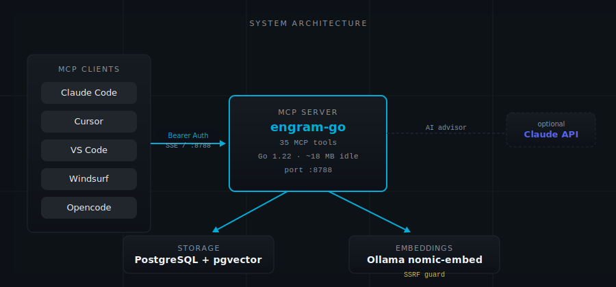

# Why Engram?

<p align="center"></p>

---

## The Frustration

You are three hours into a complex auth refactor with Claude Code. The agent knows everything that matters: you chose RS256 JWT over HS256 because the API gateway needs to verify tokens without holding the signing secret. You tracked down a subtle expiry bug — the `iat` claim was being set in UTC but validated in local time, and it failed only in certain timezones. You explicitly rejected localStorage after the agent suggested it, explained the XSS surface, and the agent agreed. You built a middleware chain and the agent knows its structure. The context window is dense with relevant, hard-won knowledge.

You close the laptop.

Next morning, you open Claude Code. The agent asks which JWT library you're using. It suggests localStorage for storing tokens. It proposes a token expiry implementation that will fail in Sydney and Tokyo. You type the same explanation you typed yesterday. You fix the same bug. You reject the same pattern. Forty minutes gone before you write a line of new code.

The agent is not getting worse. It is getting reset. Every session is the first session.

---

## The Obvious Non-Solution: Stuffing the Context

The natural response is to paste everything relevant into the system prompt — a growing block of context that travels with every conversation. This fails for four concrete reasons.

**Hard token limits.** Context windows are a ceiling, not a soft guideline. At 50 stored memories, pasting them all at session start consumes roughly 50,000 tokens before the agent has read a single line of code. That is real money at current API rates, and you hit the ceiling faster than you expect on complex projects.

**You don't know which memories matter yet.** The auth decision is irrelevant until you touch auth. The database schema decision is irrelevant until you touch the database. Pasting everything means paying for most of it to sit unused while the agent processes it anyway.

**Stale information has no flag.** You paste a block of context. Some of it is six months old and has been superseded. You don't know which parts. The agent can't know either. It treats yesterday's decision and last year's decision with the same weight.

**Relevance requires retrieval.** The right question is not "what do I know?" but "what do I need right now?" A notes file cannot answer the second question. A search system can.

The analogy holds: you could onboard a new employee every morning by emailing them the entire company wiki before each conversation. They would drown. What you actually do is answer specific questions when they come up, and point to references when the question is narrow enough to have one.

---

## Why Simple Key-Value Stores Don't Work

Suppose you store a note: "Authentication uses RS256 JWT." Then you search for "JWT token expiry bug." You get nothing. The words don't match.

This is the core failure of simple storage: knowledge doesn't come with the same label each time you need it. You might remember the concept but not the exact phrasing. The problem you're debugging now might be caused by a decision you recorded under a different name three weeks ago. Exact-match storage works for files. It fails for knowledge.

Three more problems emerge as the store grows:

**Related problems should surface together.** The auth decision caused the expiry bug. When you're debugging the expiry bug, you should see the auth decision — not because you thought to search for it, but because the system knows they're connected.

**Context accumulates without a pruning mechanism.** After 200 sessions, you have memories that contradict each other, memories that have been superseded, and memories that are simply no longer true. Without a way to weight, consolidate, and decay, the store becomes noise.

**Recency matters.** The decision you made yesterday is more likely to be current than the decision you made six months ago. A flat key-value store treats them identically.

---

## The Engram Approach: Four Signals

Engram runs four search signals on every recall and combines them into a single score. Each signal handles a different failure mode.

**BM25 keyword search** is like a card catalog that has been taught that "authentication" and "auth" and "login" are the same family of words. Full-text search with Porter stemming, running in PostgreSQL's native `tsvector` index. Fast. No embedding required. Good for cases where you remember the exact terminology — tool names, variable names, specific error messages.

**Vector semantic search** is like recognizing a song by its feel rather than its title. Each memory is embedded into a 768-dimensional space using `nomic-embed-text` running in Ollama, locally, on your machine. When you search "database lock contention," it finds your note about "WAL mode timeout under load" — no shared words, but the meaning occupies nearby coordinates in that space. This handles the cases where you remember roughly what the problem was but not what you called it. It requires Ollama running locally. If Ollama is unavailable, Engram detects this and falls back to BM25 plus recency. All tools continue to work; you lose the semantic layer.

**Recency decay** applies an exponential decay at 1% per hour to every memory's score. The decision you made yesterday scores materially higher than the same decision made six months ago, all else equal. This is not deletion — old memories remain fully searchable and will surface if you search specifically for them. Recency decay just means the current state of your project is what floats to the top by default. When you use `memory_correct` to supersede a wrong decision, both versions remain in the store. The correction wins on recency; the old version still exists for audit.

**Knowledge graph enrichment** is the mechanism that answers the question "what else should I know about this?" When you recall the auth decision, Engram traverses its graph and pulls in connected memories: the expiry bug caused by that decision, the test pattern for it, the library choice that constrained it. You followed a Wikipedia footnote and got the relevant chapter. The graph is built by explicit connections (`memory_connect`) and by feedback signals (`memory_feedback`). Over many sessions, frequently co-recalled memories develop strong edges and surface together automatically.

The four signals combine on every recall:

```
composite = (vector × 0.45) + (bm25 × 0.30) + (recency × 0.10) + (precision × 0.15)
          × importance_multiplier
```

The precision signal reflects retrieval outcome history — how often this memory was useful when recalled before. New memories start at a neutral 0.5 (neither helped nor hurt) and shift based on feedback from `memory_feedback` calls.

Importance multipliers follow the formula `(5 − importance) / 3`:

| Importance level | Value | Multiplier |
|---|---|---|
| Critical | 0 | 1.67× |
| High | 1 | 1.33× |
| Neutral | 2 | 1.00× |
| Low | 3 | 0.67× |
| Trivial | 4 | 0.33× |

A decision marked Critical — core system architecture, hard constraints — stays visible across long time spans. A note marked Trivial steps aside quickly and is pruned after 30 days without access.

<p align="center"></p>

---

## The Session Handoff Pattern

The most useful pattern is also the simplest. At the end of every session, the agent stores a handoff note. At the start of the next session, the new agent reads it.

A good handoff note is specific:

```
SESSION HANDOFF: Completed OAuth2 login flow
NEXT: Logout endpoint + token refresh
BLOCKED: Nothing
FILES: internal/auth/login.go, internal/auth/middleware.go, internal/auth/types.go
```

The next agent — tomorrow, a different IDE, a different model entirely — calls `memory_recall("session handoff", project="myapp")` in its first 30 seconds and knows exactly where to start. You stop spending the opening ten minutes of each session explaining current state.

This pattern works across tool switches. If you use Claude Code in the morning and Cursor in the afternoon, both agents connect to the same Engram server and share the same memory store. The handoff note doesn't care which client wrote it.

The pattern also works when you return to a project after a long absence. A project you touched six months ago still has its architecture decisions, its known bugs, its established patterns. The recency decay means old memories won't crowd out new work — but they're there when you need them.

---

## Projects and Global

Every memory is stored in a project namespace. `project="clearwatch"` and `project="homelab"` are completely separate. Memories stored in one are invisible to agents working in the other. You can have dozens of projects in the same Engram instance and they will not interfere with each other.

One namespace crosses project boundaries: `project="global"`. Use it for preferences that apply everywhere — code style conventions, tool preferences, personal rules, infrastructure standards. Any agent on any project can recall from global. The clearwatch agent can see your preference for tabs over spaces. The homelab agent can see your Kubernetes naming conventions.

Each project is a separate filing cabinet. Global is the shared desk everyone can reach.

---

## What Engram Does Not Do

**It is not a documentation system.** Engram works best with short, focused memories — a decision and its reasoning, a bug and its fix, a pattern and when to apply it. Long documents can be stored with `memory_store_document`, which chunks and indexes them, but Engram is not a replacement for a wiki or a spec file. It is the index to those things, not the things themselves.

**It is not magic.** The quality of what you get back depends on the quality of what you put in. A memory that says "fixed the auth bug" is nearly useless. A memory that says "the token expiry validation was comparing UTC `iat` against localtime — fixed by standardizing to UTC throughout the auth package" is searchable, specific, and useful six months later.

**Semantic search requires Ollama.** The 768-dimensional embeddings run locally via Ollama. If you don't want to run Ollama, BM25 and recency still work. The system degrades gracefully. But the cases where semantic search matters most — vague queries, concept-not-keyword situations — will not be covered.

---

## The Trade-Off

Engram is a local service. It needs PostgreSQL and, for full functionality, Ollama. That is two extra Docker containers and some RAM. The Go rewrite reduced the overhead considerably — 18 MB idle for the server itself, 10 MB container — but the database and embedding model add to that.

The trade-off is real: if you want zero infrastructure, a notes file is simpler. But a notes file does not search by meaning. It does not surface connected decisions. It does not weight by recency. And when you are three sessions into a complex feature, the difference between "paste notes into context" and "recall exactly what's relevant" is not a small one.

---

*[Back to README](../README.md) — [How It Works](how-it-works.md)*
